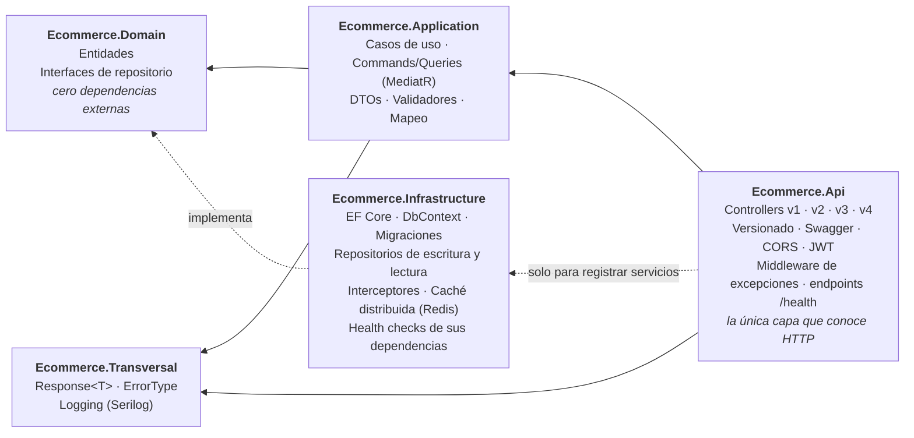

# Backend Portfolio — API Ecommerce

API REST en **.NET 10** con **Clean Architecture**, **JWT** y **EF Core 10** sobre SQL Server. Es un
portfolio de aprendizaje y de demostración de lo que he aprendido haciendo backend en C#, no un producto:
el objetivo no es la cantidad de funcionalidad, sino la **calidad de las decisiones** — por qué cada pieza
está donde está y qué se rompería si estuviera en otro sitio.

**Lo que la diferencia:** el mismo recurso (`Customer`) está implementado **cuatro veces, una por versión de
la API, y las cuatro conviven**: Repository → Unit of Work → CQRS con MediatR → validación en el pipeline.
Así cada decisión se compara en código que funciona, no en un párrafo.

> [!IMPORTANT]
> **No está pensado para producción**, y las razones son concretas:
>
> - **Hay contrastes puestos a propósito.** v1 es el antipatrón y v4 resuelve con una excepción un fallo
>   esperado. Conviven con el resto para poder compararlos.
> - **Hay piezas que son ejercicios, no soluciones.** El rate limiter y la caché con Redis son versiones
>   simplificadas para ver el patrón de punta a punta; no responden a un problema medido.
> - **Hay deuda, y está a la vista.** Las **26 limitaciones conocidas** están en
>   [*limitaciones conocidas*](docs/limitaciones.md) con el mecanismo de cada fallo, y el orden en que se
>   van a abordar, en la [hoja de ruta](#hoja-de-ruta). Si vas a evaluar el proyecto, esa lista forma parte
>   de él tanto como el código.

**Por dónde empezar:** [`Controllers/v1`](Ecommerce/Controllers/v1/CustomerController.cs) →
[`v4`](Ecommerce/Controllers/v4/CustomerController.cs), con la tabla de abajo al lado.

---

## Las cuatro versiones

Cada una resuelve el mismo caso de uso con un enfoque distinto; que convivan es lo que permite evaluar la
evolución desde la propia API.

| | **v1** | **v2** | **v3** | **v4** |
|---|---|---|---|---|
| Enfoque | Repositorio directo | Unit of Work | CQRS con MediatR | CQRS + validación en el pipeline |
| Quién confirma (`SaveChanges`) | Cada método del repositorio | El caso de uso, una vez | El handler, una vez | El handler, una vez |
| Lecturas | Mismo repositorio | Mismo repositorio | Repositorio de lectura separado | Repositorio de lectura separado |
| Controller depende de | `ICustomerApplication` | `ICustomerApplicationUoW` | Solo `IMediator` | Solo `IMediator` |
| Dónde se valida | Caso de uso | Caso de uso | Handler → `Response.Invalid` | `ValidationBehaviour` → excepción → middleware |
| Detección de duplicados | No | Sí → 409 | Sí → 409 | Sí → 409 |
| Qué demuestra | **El antipatrón**, a propósito | El límite transaccional en el caso de uso | Separación de comandos y consultas | La validación como preocupación transversal |
| Estado | `Deprecated` | Vigente | Vigente | Vigente |

> **Un matiz sobre la comparación.** v3 y v4 comparten `ICustomerReadRepository`, así que la caché del
> listado entró en las dos a la vez: en `GetAllAsync` se comportan hoy igual y arrastran la misma falta de
> invalidación. La tabla sigue siendo exacta en *dónde se valida*, pero cualquier pieza que se añada al lado
> de lectura afecta a ambas. Ver [pendientes nº 24 y 28](docs/limitaciones.md).

Detrás de cada controller, su implementación en
[`Application/Feature/Customers`](Ecommerce.Application/Feature/Customers). El porqué de cada salto está en
[*Evolución v1 → v4*](docs/evolucion-v1-v4.md).

---

## Documentación

Este fichero es el recorrido corto: qué es, cómo está montado y cómo se arranca. El razonamiento vive en
`docs/`, un documento por tema, en el orden de lectura recomendado.

| Documento | Qué responde |
|---|---|
| [Evolución v1 → v4](docs/evolucion-v1-v4.md) | Los tres saltos —límite transaccional, CQRS, validación en el pipeline— y qué problema abría cada uno |
| [Decisiones técnicas](docs/decisiones-tecnicas.md) | `Response<T>`, Unit of Work, logging, rate limiting, caché con Redis, health checks |
| [Endpoints](docs/endpoints.md) | Rutas de las cuatro versiones, el contrato `Response<T>` y los códigos de estado |
| [Versionado de la API](docs/versionado-api.md) | Por qué segmento de URL y no cabecera, y cómo conviven cuatro contratos en Swagger |
| [Tests](docs/tests.md) | Qué se dobla y qué se usa real, y qué demuestran los 271 tests que no se ve leyendo el código |
| [Integración continua](docs/integracion-continua.md) | Los tres workflows de GitHub Actions y lo que la CI todavía no hace |
| [Patrones y arquitectura (guion de entrevista)](docs/patrones-y-arquitectura-entrevista.md) | El recorrido corto para explicar el proyecto en voz alta, y las preguntas que suelen venir después |
| [Limitaciones conocidas](docs/limitaciones.md) | Las 26 limitaciones, por prioridad y con el mecanismo de cada fallo |

---

## Arquitectura

Clean Architecture / Onion, con la regla de dependencia como única norma innegociable: **las dependencias
apuntan siempre hacia dentro**, hacia lo que menos cambia.



La prueba de que la regla se cumple no está en la estructura de carpetas, sino en los `.csproj`:
**`Ecommerce.Domain` no tiene un solo `PackageReference`**. Las interfaces de repositorio viven ahí — en
quien las *usa* — y `Infrastructure` las implementa; ahí está la inversión de dependencias.

| Proyecto | Responsabilidad |
|---|---|
| `Ecommerce.Api` | Traduce HTTP ↔ casos de uso. Versionado, autenticación, rate limiting, Swagger, manejo global de excepciones, exposición de `/health`. Composition root. |
| `Ecommerce.Application` | Orquesta los casos de uso (servicios en v1/v2, handlers de MediatR en v3 y v4). No sabe qué es un código HTTP. |
| `Ecommerce.Domain` | Entidades y contratos. No sabe que existe una base de datos. |
| `Ecommerce.Infrastructure` | Persistencia con EF Core y caché con Redis. Implementa los contratos del dominio y vigila las dependencias que ella misma abre. Ningún almacén de datos asoma por encima de esta capa. |
| `Ecommerce.Transversal` | Tipos compartidos por varias capas (`Response<T>`, `ErrorType`, logging). |
| `Ecommerce.Test` | xUnit + NSubstitute + EF Core InMemory. |

`Application` se organiza por *feature* y, dentro de `Customers`, por versión, para que la comparación se
lea en el árbol de carpetas: en v3 y v4 cada operación es una carpeta autocontenida con su command, su
handler y su validador, y `Common/Behaviours` reúne las piezas del pipeline de MediatR.

<details>
<summary>Ver el árbol de <code>Application</code></summary>

```
Feature/
├── Customers/
│   ├── v1/  CustomerApplication.cs          ← repositorio que confirma
│   ├── v2/  CustomerApplicationUoW.cs       ← Unit of Work
│   ├── v3/
│   │   ├── Commands/   CreateCustomer · UpdateCustomer · DeleteCustomer
│   │   │                 (cada una: Command · Handler · Validator)
│   │   └── Queries/    GetAllCustomerQuery · GetCustomerQuery
│   └── v4/   misma estructura; GetCustomerQuery gana Validator y los handlers pierden IValidator
├── Users/   UserAuthApplication.cs
└── Jwt/     JwtApplication.cs

Common/
├── Behaviours/
│   ├── LoggingBehaviour.cs            ← todo lo que pasa por Send (v3 y v4)
│   ├── ValidationBehaviour.cs         ← solo peticiones marcadas con IValidatableRequest (v4)
│   └── Exceptions/ValidationExceptionCustom.cs
└── Interface/IValidatableRequest.cs
```

</details>

---

## Stack

| | |
|---|---|
| **Base** | .NET 10 · C# · ASP.NET Core Web API · EF Core 10 (Code First) sobre SQL Server |
| **Patrones** | MediatR (CQRS en v3 y v4, con *pipeline behaviors*) · FluentValidation · AutoMapper |
| **Transversal** | Asp.Versioning (versionado por URL) · JWT Bearer · Serilog (consola, fichero y SQL Server) · Swashbuckle/OpenAPI, un documento por versión |
| **Resiliencia** | Redis vía `IDistributedCache` (*cache-aside*) · rate limiter nativo de ventana fija · AspNetCore.HealthChecks (`/health` y `/health/ui`) — las tres, en versión simplificada |
| **Tests y CI** | xUnit · NSubstitute · EF Core InMemory · Coverlet · tests de integración con SQL Server real · GitHub Actions con gitleaks y comprobación del build de la imagen Docker |
| **Contenedores** | Dockerfile *multi-stage* (imagen `aspnet` sin privilegios) · `docker-compose` con API, SQL Server y Redis, con los secretos montados como archivos |

---

## Puesta en marcha

**Requisitos:** SDK de .NET 10, una instancia de SQL Server (vale SQL Server Express) y una de Redis. Para
Redis en local, lo más rápido es `docker run -p 6379:6379 redis`. Sin Redis la API arranca, pero
`GET /GetAllAsync` de v3 y v4 responde 500 al no poder hablar con la caché — es el pendiente nº 26.

```bash
git clone https://github.com/rubendevvalencia/BackendPortfolio.git
cd BackendPortfolio/Monolito
```

El repositorio es un monorepo: esta carpeta (`Monolito/`) contiene la API Ecommerce, el laboratorio de
aprendizaje; la arquitectura de destino vive en `Microservicios/`, en la raíz.

**1. Configura los secretos.** `appsettings.json` declara las claves pero las deja vacías a propósito: el
archivo define la *forma* de la configuración, no sus valores.

```bash
dotnet user-secrets set "ConnectionStrings:EcommerceDb" \
  "Server=localhost\SQLEXPRESS;Database=Ecommerce;Trusted_Connection=True;TrustServerCertificate=True;" \
  --project Ecommerce

dotnet user-secrets set "ConnectionStrings:RedisConnection" "localhost:6379" --project Ecommerce

dotnet user-secrets set "Jwt:Key" "<clave aleatoria de 32 bytes o mas>" --project Ecommerce
```

La clave JWT no es opcional: HMAC-SHA256 exige 256 bits, y el límite se mide en bytes, no en caracteres.
En despliegue esos valores llegan por variables de entorno: `ConnectionStrings__EcommerceDb`,
`ConnectionStrings__RedisConnection` y `Jwt__Key`.

**2. Crea la base de datos.**

```bash
dotnet ef database update --project Ecommerce.Infrastructure --startup-project Ecommerce
```

**3. Arranca.**

```bash
dotnet run --project Ecommerce
```

Swagger queda en `https://localhost:7051/swagger`, con el desplegable de versiones arriba a la derecha. La
misma documentación, en formato de lectura con ReDoc, está en `https://localhost:7051/api-docs` (solo
muestra la última versión, la v4). Los tests, con `dotnet test`.

**Con Docker en vez de local.** [`Docker/docker-compose.yml`](../Docker/docker-compose.yml) levanta la API,
SQL Server y Redis. Los secretos se montan como archivos desde una carpeta tuya, fuera del repo:

```bash
# SECRETS_DIR debe contener secrets.json ({ "Jwt:Key": "...", "ConnectionStrings:EcommerceDb": "..." })
# y sa_password (la contraseña de sa en texto plano, la misma que en la cadena de conexión)
SECRETS_DIR=<ruta> docker compose -f ../Docker/docker-compose.yml up --build
```

La API queda en `http://localhost:8080`.

> [!NOTE]
> **Tres comportamientos que son decisión, no fallo**, para que no parezca que algo no funciona:
>
> - **El rate limiter es muy estricto a propósito:** 4 peticiones cada 30 s por IP (cola de 2) en los
>   controllers de `Customer`, y 3 por minuto en `SignIn`/`SignUp`. Es un ejercicio para ver el 429 con
>   pocas peticiones. Para probar con holgura, sube `RateLimiting:PermitLimit` en `appsettings.json`.
> - **`/health` responde 503 de forma intermitente:** incluye `HealthCheckCustome`, una comprobación de
>   demostración con `Random` que devuelve Healthy, Degraded o Unhealthy para poder ver los tres estados en
>   `/health/ui`. SQL Server y Redis se comprueban de verdad; ese check concreto no. Detalle en
>   [*Decisiones técnicas*](docs/decisiones-tecnicas.md).
> - **Con Docker no hay Swagger ni ReDoc:** el contenedor corre en `Production` y ambos solo se activan en
>   `Development`. Para explorar la API, usa `dotnet run` (Swagger en `/swagger`, ReDoc en `/api-docs`) o las rutas de
>   [*Endpoints*](docs/endpoints.md).

`Ecommerce.slnx` incluye también `Ecommerce.IntegrationTest`, así que `dotnet test` sobre la solución
completa arrastra sus tests: necesitan la misma SQL Server real de arriba (los aplica con
`dbContext.Database.Migrate()` al vuelo) y los mismos *user secrets*. Para correr solo la suite unitaria,
sin esa dependencia, `dotnet test Ecommerce.Test/Ecommerce.Test.csproj`.

---

## Endpoints

Todos exigen `Authorization: Bearer <token>` salvo `SignUp` y `SignIn`, y todos devuelven la misma
envoltura `Response<T>`, cuyo `ErrorType` es lo que el controller traduce a 200, 400, 404, 409 o 500.

| Recurso | Rutas |
|---|---|
| `api/v{1\|2\|3\|4}/UserAuth` | `POST /SignUp` · `POST /SignIn` |
| `api/v{1\|2}/Customer` | `GET /GetAllAsync` · `GET /GetByIdAsync/{id}` · `POST /AddAsync` · `PUT /UpdateAsync{id}` · `POST /UpdateAsyncPost/{id}` · `DELETE /DeleteAsync/{id}` |
| `api/v{3\|4}/Customer` | Lo mismo, con `AddAsync` renombrado a `Create` y sin `PUT`: la actualización va por `POST /UpdateAsyncPost` con el `Id` en el cuerpo |

**El detalle está en [*Endpoints*](docs/endpoints.md)**: cuerpos de petición y respuesta, la tabla de
`ErrorType` → código HTTP, en qué se diferencia el 400 de v4 y los dos avisos que conviene leer antes de
probarla (el listado cacheado sin invalidar, y las rutas con el verbo dentro de la URL).

---

## Estado actual

Compila sin errores y **271 de 271 tests en verde**, en local y en la CI. A eso se suma
`Ecommerce.IntegrationTest`, un proyecto aparte con un primer test de integración —`SignUp → SignIn`,
resolviendo el controller real desde el contenedor de DI contra una base de datos SQL Server real, sin
dobles— que hoy **solo corre en local**: la CI de GitHub Actions lo deja fuera a propósito, porque el
runner no tiene ni SQL Server ni los *user secrets* que necesita (detalle en
[*Integración continua*](docs/integracion-continua.md)). Hay **26 limitaciones conocidas** (de 31
anotadas, cinco ya resueltas), cada una con su mecanismo explicado en
[*limitaciones conocidas*](docs/limitaciones.md).

| Área | Pendientes | Las que más pesan |
|---|---|---|
| Seguridad | 2 | Emails de usuario persistidos en la tabla de logs (nº 19) · al 429 del rate limiter le falta `Retry-After` (nº 23) |
| Corrección | 8 | La caché no se invalida nunca (nº 24) · actualizar con los mismos datos devuelve 500 (nº 4) |
| Tests | 3 | La frontera HTTP no tiene ni un test de integración (nº 8) · la caché tampoco tiene ninguno (nº 29) |
| Diseño | 8 | El dominio es anémico (nº 12) · se cachea la entidad con una clave sin versionar (nº 27) |
| Higiene | 5 | Sin paginación en `GetAll`, que además es el endpoint cacheado (nº 18) |

No es una lista de descuidos que se hayan escapado: es lo que sé que falta y en qué orden pienso resolverlo.

<details>
<summary>Historial de cambios — los 21 hitos, en el orden en que se construyeron</summary>

| # | Cambio | Qué resolvió |
|---|---|---|
| 1 | Clean Architecture en 5 proyectos · CRUD de `Customer` con EF Core | Base con la regla de dependencia verificable en los `.csproj` |
| 2 | FluentValidation · `Response<T>` · `ErrorType` | Fallos esperados sin excepciones; `Application` sin conocer HTTP |
| 3 | Migraciones EF · interceptor de auditoría · CORS | Esquema versionado y auditoría en un punto único |
| 4 | JWT · hash con `IPasswordHasher<T>` · User Secrets | Autenticación y secretos fuera del repositorio |
| 5 | Serilog (consola, fichero, SQL Server) | Logging estructurado con destinos según severidad |
| 6 | Versionado de API · Swagger por versión | Posibilidad de convivir contratos distintos |
| 7 | **v1 sin UoW / v2 con Unit of Work** | Límite transaccional movido al caso de uso, con el antipatrón como contraste |
| 8 | Tests de `Infrastructure` y `Application` · test del composition root | Comportamiento fijado antes de refactorizar |
| 9 | **Middleware global de excepciones** · retirada de `try/catch` en v1 y v2 | Un único punto para lo inesperado; los casos de uso dejan subir la excepción |
| 10 | **v3 con CQRS (MediatR)** · commands y queries por carpeta · repositorio de lectura | Separación de escrituras y lecturas; controller acoplado solo a `IMediator` |
| 11 | Detección de duplicados → 409 en v2 y v3 | Alta duplicada como resultado de negocio, no como error |
| 12 | Tests de v3 · reorganización de tests por feature y versión | La suite refleja la misma estructura que el código |
| 13 | **`LoggingBehaviour` en el pipeline de MediatR** · `IApiLogger` conservado como el enfoque manual | Traza automática de v3 sin tocar los handlers, y el reparto explícito entre interceptor y call site |
| 14 | **v4: `ValidationBehaviour`** · `IValidatableRequest` · `ValidationExceptionCustom` → 400 en el middleware | Validación fuera de handlers y controller, aislada de v3 con una marca en la petición |
| 15 | **Rate limiter de ventana fija** (versión simplificada, de prueba) · 429 · valores en `appsettings.json` | Primer freno a ráfagas de peticiones, con la configuración validada al arrancar |
| 16 | **Health checks** (`/health` en JSON, `/health/ui` en HTML) con SQL Server y Redis | Las dependencias externas dejan de fallar en silencio |
| 17 | **Caché distribuida con Redis** sobre `GetAllCustomers` (*cache-aside*, a modo de ejercicio) · caducidades por política en configuración | El patrón montado de punta a punta dentro de `Infrastructure` — con la invalidación todavía pendiente, que es su parte difícil |
| 18 | **Health checks repartidos por capa**: el registro baja a `Infrastructure` y `Api` se queda solo con `MapHealthChecks` y el HTML | Los paquetes de sonda salen del `.csproj` de `Api`: la capa que no sabe que existe una base de datos deja de declarar cómo se comprueba |
| 19 | **Integración continua con GitHub Actions**: `ci-monolito` (build y tests), `secret-scan` con gitleaks y `docker-monolito` (build de la imagen), en cada push y PR contra `dev` y `main` | Que la solución compile y los tests pasen deja de depender de mi máquina, una credencial nueva no entra sin avisar, y el Dockerfile no se rompe sin que nadie lo note |
| 20 | **Cuatro correcciones de seguridad**: middleware de excepciones movido al principio del pipeline con mensaje genérico (nº 1) · `EnableSensitiveDataLogging` solo en desarrollo (nº 2) · `SignIn` responde siempre el mismo 401 (nº 3) · rate limiter particionado por IP, con política propia y más estricta para `SignIn`/`SignUp` (nº 23, sin cerrar del todo: falta `Retry-After`) | Cierra la fuga de la excepción cruda, la de los valores de `PasswordHash` en el log de EF, la enumeración de usuarios por `SignIn` y el contador de rate limit compartido por todos los clientes |
| 21 | **Dockerfile y `docker-compose`**: imagen *multi-stage* con el `restore` en su propia capa y usuario sin privilegios, y un compose local con API, SQL Server y Redis | El monolito se levanta con un solo comando y la misma imagen es la que se desplegará |

</details>

---

## Hoja de ruta

Bloques en el orden en que se van a abordar. El criterio: lo que modifica el contrato público va antes que
lo que lo publica, porque una vez publicado, cambiarlo es un *breaking change*.

| Bloque | Contenido | Estado |
|---|---|---|
| **A** | Versionado de la API · limpieza de rutas a REST · healthcheck | 🟡 Versionado y healthcheck hechos; rutas por limpiar |
| **B** | Unit of Work · middleware global de excepciones · `EnableSensitiveDataLogging` por entorno | 🟢 Cerrado: Unit of Work, middleware al principio del pipeline (nº 1) y `EnableSensitiveDataLogging` solo en desarrollo (nº 2) |
| **C** | Tests de `Application` · CQRS con MediatR · *pipeline behaviors* · tests de integración | 🟡 Hechos los tests de `Application`, los behaviours y un primer test de integración (`SignUp → SignIn`); faltan los de `LoggingBehaviour`, el resto de la frontera HTTP y meterlos en la CI |
| **D** | Dominio con invariantes · modelado relacional (`Order` → `OrderLine`) · paginación · Postgres | ⬜ |
| **E** | GitHub Actions · Dockerfile · despliegue en Azure | 🟡 CI y Dockerfile hechos (la CI comprueba que la imagen construye); falta el despliegue |
| **F** | Rendimiento y resiliencia: caché *cache-aside* · rate limiting · health checks | 🟡 Las tres montadas en versión simplificada; a la caché le falta la invalidación (nº 24) y al rate limiter, ya particionado por IP con política propia para `SignIn`/`SignUp`, le falta `Retry-After` en el 429 (nº 23) |

Siguientes pasos, por orden:

1. **Cerrar la caché**, que es regresión reciente y no deuda antigua: invalidación tras el commit con un
   `SaveChangesInterceptor` (nº 24), modelo de caché propio y clave versionada (nº 27), validación al
   arrancar (nº 25) y degradación si Redis no responde (nº 26). Sin la invalidación, lo que hay montado
   demuestra solo la mitad fácil del patrón.
2. **Cerrar v4 y el logging**: unificar el contrato de error de validación (nº 20), los tests que faltan de
   `LoggingBehaviour` y de la caché (nº 29), y cablear `IApiLogger` en v1 y v2, que es donde el enfoque
   manual es el único disponible.
3. **Autenticación**: `JwtOptions` validadas al arrancar, `ITokenService` en `Infrastructure`, y `Retry-After`
   en el 429 del rate limiter (nº 23) — el 401 único de `SignIn` ya está cerrado.
4. **Tests de integración**: ya hay un primer caso (`SignUp → SignIn`) contra una base de datos real,
   resolviendo el controller desde el contenedor de DI en vez de con `WebApplicationFactory`; falta
   extenderlos al CRUD de `Customer` en las cuatro versiones y decidir cómo entran en la CI.
5. **Paginar `GetAll`** (nº 18) y, con la paginación puesta, volver a preguntarse qué caché tiene sentido —la
   respuesta puede ser perfectamente que ninguna.
6. **Bloque D**: un agregado real (`Order` → `OrderLine`) donde el Unit of Work tenga dos tablas que
   confirmar de forma atómica.

---

## Licencia

Portfolio personal de aprendizaje y demostración de conocimientos, sin licencia de uso definida.
