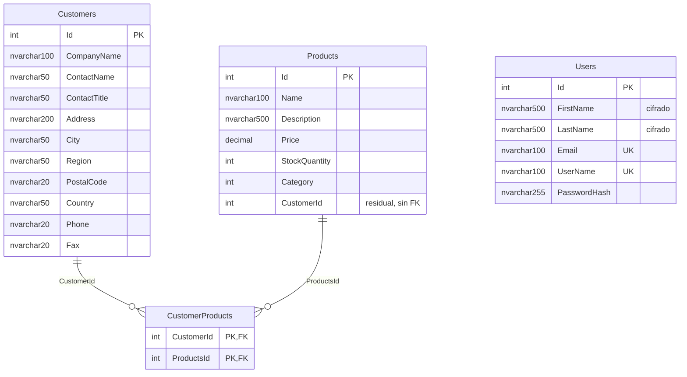

# Modelo de datos e Infrastructure

[← Volver al README](../README.md)

Qué tablas hay en la base de datos, de dónde sale cada una y qué piezas de `Ecommerce.Infrastructure` las
construyen. Se actualiza con cada migración; el estado descrito es el de la migración
`20261006152443_AddCustomerProductTable`.

---

## Tablas



`Customers`, `Products` y `Users` llevan además las cuatro columnas de auditoría de `BaseAuditEntity`
(`CreatedAt`, `CreatedBy`, `LastUpdatedAt`, `LastUpdatedBy`), que no se dibujan para no ensuciar el
diagrama. `CustomerProducts` no hereda de `BaseAuditEntity`: es una tabla de unión sin entidad propia.

| Tabla | Entidad | Configuración | Migración que la crea |
|---|---|---|---|
| `Customers` | `Customer` | `CustomerConfiguration` | `InitialCreate` |
| `Users` | `User` | `UserConfiguration` | `AddUsersTable` (+ índices únicos, tamaños) |
| `Products` | `Product` | `ProductConfiguration` | `AddProductsTable` |
| `CustomerProducts` | *(ninguna: tabla de unión)* | `CustomerConfiguration` | `AddCustomerProductTable` |

### `Products`

| Columna | Tipo | Restricciones |
|---|---|---|
| `Id` | `int` | PK, `IDENTITY(1,1)` |
| `Name` | `nvarchar(100)` | obligatoria |
| `Description` | `nvarchar(500)` | opcional |
| `Price` | `decimal(18,2)` | obligatoria |
| `StockQuantity` | `int` | obligatoria |
| `Category` | `int` | obligatoria; guarda el valor del enum `Category` (`Book`=1, `Electronics`=2, `Clothing`=3, `Home`=4, `Other`=5) |

### `CustomerProducts`

Tabla de unión de la relación **muchos a muchos** entre `Customers` y `Products`: un cliente puede tener
varios productos y un producto pertenecer a varios clientes.

| Columna | Tipo | Restricciones |
|---|---|---|
| `CustomerId` | `int` | PK compuesta, FK → `Customers.Id`, `ON DELETE CASCADE` |
| `ProductsId` | `int` | PK compuesta, FK → `Products.Id`, `ON DELETE CASCADE`; índice `IX_CustomerProducts_ProductsId` |

La PK compuesta impide que el mismo producto se asocie dos veces al mismo cliente. El cascade en ambos
lados significa que borrar un cliente o un producto borra sus filas de la tabla de unión, **nunca** la
entidad del otro lado.

---

## La relación `Customer` ↔ `Product` y cómo llegó hasta aquí

Se modeló en dos migraciones, y la segunda corrige a la primera:

1. **`AddProductsTable`** creó `Products` con una columna `CustomerId` y una FK a `Customers` con
   `CASCADE`. Es una relación **1:N**: cada producto pertenecía a un único cliente, y borrar el cliente
   borraba sus productos.
2. **`AddCustomerProductTable`** la sustituye por **N:M**: elimina la FK y el índice de `Products.CustomerId`
   y crea `CustomerProducts`. Un producto es ahora un elemento de catálogo que se *asigna* a clientes, no
   algo que un cliente *posee*.

La configuración vive en `CustomerConfiguration`:

```csharp
builder.HasMany(c => c.Products)
    .WithMany(p => p.Customer)
    .UsingEntity(j => j.ToTable("CustomerProducts"));
```

Sin entidad intermedia (*skip navigation*): EF Core genera la tabla de unión con las dos claves y
`Customer.Products` / `Product.Customer` son las dos navegaciones. Si algún día la asignación necesita
datos propios (fecha, cantidad), esa tabla pasa a ser una entidad.

> [!NOTE]
> **Dos restos del modelo 1:N que siguen en el código:**
>
> - La columna `Products.CustomerId` **sigue existiendo** (`int NULL`, sin FK ni índice): la migración quitó
>   la restricción, no la columna. La propiedad `Product.CustomerId` sigue en la entidad y ya no significa
>   nada; asignar un producto a un cliente se hace **solo** por `CustomerProducts`.
> - El comentario de `CustomerConfiguration` sobre "uno a muchos" ya no describe lo que hace la llamada.
>
> Quitarlos es una migración más (`DropColumn`) y borrar la propiedad; no se ha hecho para no mezclarlo
> con este cambio.

---

## Caso de uso: asignar un producto a un cliente

`POST api/v4/Customer/SaveProduct` con `{ "customerId": 1, "productId": 2 }` →
`ProductToCustomerCommand`, validado por `ValidationBehaviour` (ambos `Id` mayores que 0).

El handler (`ProductToCustomerCommandHandle`) usa el Unit of Work, porque toca dos repositorios en una
misma operación:

1. Carga el cliente (`_customersUoW.GetByIdAsync`) y el producto (`_products.GetByIdAsync`). Si falta
   alguno → `ErrorType.NotFound` → 404.
2. Añade el producto a `customer.Products` y marca el cliente como modificado.
3. Un único `SaveChangesAsync`: EF inserta la fila en `CustomerProducts` y el interceptor de auditoría
   actualiza `LastUpdatedAt`/`LastUpdatedBy` del cliente.

Para crear productos, `POST api/v4/Product/Create` (`CreateProductCommand`, 409 si ya existe uno con los
mismos datos). Update y Delete de `Product` están como carpetas vacías o comentados: pendientes.

---

## Infrastructure: qué cambió

| Pieza | Cambio |
|---|---|
| `DbContextEF` | Nuevo `DbSet<Product> Products`. No hay `DbSet` para `CustomerProducts`: EF la gestiona a través de las navegaciones. Las configuraciones se cargan solas con `ApplyConfigurationsFromAssembly`. |
| `Persistence/ProductConfiguration` | Nueva: tabla `Products`, `Name` (100) y `Description` (500), y `Price`, `StockQuantity` y `Category` obligatorios. |
| `Persistence/CustomerConfiguration` | Añade la relación N:M con `Product` y la tabla `CustomerProducts`. |
| `Repository/Product/ProductRepository` | Nuevo, bajo el patrón Unit of Work: **ninguno de sus métodos confirma**. Incluye `CompareInfoInDb`, que la detección de duplicados usa comparando nombre, descripción, precio y stock. |
| `Repository/UnitOfWork` | Expone `_products` (`IProductRepository`) junto a `_customersUoW` y `_user`; sigue habiendo un único `SaveChangesAsync`. |
| `ConfigureServices` | Registra `IProductRepository` → `ProductRepository` (scoped). |
| `Migrations` | Dos nuevas: `AddProductsTable` y `AddCustomerProductTable`; el snapshot refleja el estado final. |

Las entidades nuevas pasan por el mismo `AuditableEntitySaveChangesInterceptor` que el resto, porque
`Product` hereda de `BaseAuditEntity`. `Discount` y `DiscountStatus` existen en `Domain` pero **no están
mapeadas** (sin `DbSet` ni tabla): código muerto, ya anotado en [*limitaciones*](limitaciones.md).

---

## Aplicar los cambios a la base de datos

```bash
dotnet ef database update --project Ecommerce.Infrastructure --startup-project Ecommerce
```

Sobre una base ya creada solo aplica las dos migraciones pendientes. Para volver al estado anterior a la
tabla de unión (restaura la FK 1:N): `dotnet ef database update AddProductsTable`. Más detalle de la CLI en
la skill `migraciones-ef-core`.

> [!WARNING]
> `AddCustomerProductTable` **no migra datos**: elimina la FK sin copiar a `CustomerProducts` lo que
> hubiera en `Products.CustomerId`. Si hay productos con cliente asignado en una base real, esas
> asignaciones se pierden al aplicarla. En una base de desarrollo vacía no importa.
