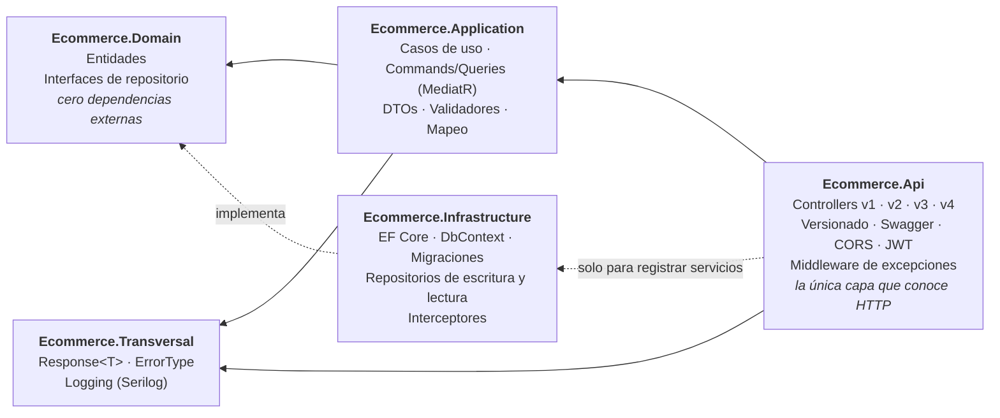

# Backend Portfolio — API Ecommerce

> **En 30 segundos**
>
> - **Qué es:** API REST en **.NET 10** con **Clean Architecture** (5 capas + tests), autenticación **JWT** y **EF Core 10** sobre SQL Server.
> - **Qué la diferencia:** el mismo recurso implementado en **cuatro versiones de la API que conviven**: Repository → Unit of Work → **CQRS con MediatR** → validación en el pipeline. Así cada decisión se puede comparar en código que funciona.
> - **Patrones:** CQRS con repositorios de lectura y escritura separados · Unit of Work · *pipeline behaviors* (logging y validación) · *Result pattern* (`Response<T>`) + middleware global de excepciones.
> - **Transversal:** versionado por URL con un documento Swagger por versión · Serilog a consola, fichero y SQL Server según el nivel · auditoría con un interceptor de EF Core · rate limiting con ventana fija (versión simplificada, de prueba) · secretos fuera del repositorio.
> - **Tests:** 131 con xUnit, NSubstitute y EF Core InMemory: repositorios, handlers, validadores, behaviours y la configuración de dependencias.
> - **Stack:** C# · ASP.NET Core · EF Core · SQL Server · MediatR · FluentValidation · AutoMapper · JWT · Serilog · Swagger · xUnit
> - **Por dónde empezar:** [`Controllers/v1`](Ecommerce/Controllers/v1/CustomerController.cs) → [`v4`](Ecommerce/Controllers/v4/CustomerController.cs) y la tabla de [*Cómo leer este repositorio*](#cómo-leer-este-repositorio).
> - **Trabajo pendiente, a la vista:** limitaciones conocidas y [hoja de ruta](#hoja-de-ruta) (tests de integración, Docker/CI, dominio rico) documentadas al final.

API REST en **.NET 10** construida con **Clean Architecture**, como proyecto de portfolio y aprendizaje
deliberado de backend en C#.

El objetivo no es la cantidad de funcionalidad, sino la **calidad de las decisiones**: por qué cada pieza
está donde está, qué problema resuelve y qué se rompería si estuviera en otro sitio. El código lleva
comentarios que explican el *porqué*, no el *qué* — están puestos a propósito, con fines didácticos, y en
un proyecto de producción tendrían bastante menos densidad.

---

## Cómo leer este repositorio

**El mismo recurso (`Customer`) está implementado cuatro veces, una por versión de la API.** No es
duplicación accidental: cada versión resuelve el mismo caso de uso con un enfoque distinto, y que convivan
es lo que permite evaluar la evolución completa desde la propia API — mismo recurso, cuatro formas de decidir
dónde vive la transacción, cómo se separan lecturas y escrituras y dónde se valida.

| | **v1** | **v2** | **v3** | **v4** |
|---|---|---|---|---|
| Enfoque | Repositorio directo | Unit of Work | CQRS con MediatR | CQRS + validación en el pipeline |
| Quién confirma (`SaveChanges`) | Cada método del repositorio | El caso de uso, una vez | El handler, una vez | El handler, una vez |
| Lecturas | Mismo repositorio | Mismo repositorio | Repositorio de lectura separado | Repositorio de lectura separado |
| Controller depende de | `ICustomerApplication` | `ICustomerApplicationUoW` | Solo `IMediator` | Solo `IMediator` |
| Dónde se valida | Caso de uso | Caso de uso | Handler → `Response.Invalid` | `ValidationBehaviour` → excepción → middleware |
| Detección de duplicados | No | Sí → 409 | Sí → 409 | Sí → 409 |
| Qué demuestra | **El antipatrón**, a propósito | El límite transaccional en el caso de uso | Separación de comandos y consultas | La validación como preocupación transversal |
| Estado | `Deprecated` | Vigente | Vigente | Vigente |

Recorrido recomendado: [`Controllers/v1`](Ecommerce/Controllers/v1/CustomerController.cs) →
[`v2`](Ecommerce/Controllers/v2/CustomerController.cs) → [`v3`](Ecommerce/Controllers/v3/CustomerController.cs) →
[`v4`](Ecommerce/Controllers/v4/CustomerController.cs), y detrás de cada uno su implementación en
[`Ecommerce.Application/Feature/Customers`](Ecommerce.Application/Feature/Customers). Las secciones
[*Evolución v1 → v4*](#evolución-v1--v4) y [*Decisiones técnicas*](#decisiones-técnicas) explican
el porqué de cada salto.

---

## Arquitectura

Clean Architecture / Onion, con la regla de dependencia como única norma innegociable: **las dependencias
apuntan siempre hacia dentro**, hacia lo que menos cambia.



La prueba de que la regla se cumple no está en la estructura de carpetas, sino en los `.csproj`:
**`Ecommerce.Domain` no tiene un solo `PackageReference`**. Las interfaces de repositorio viven ahí — en
quien las *usa* — y `Infrastructure` las implementa; ahí está la inversión de dependencias.

| Proyecto | Responsabilidad |
|---|---|
| `Ecommerce.Api` | Traduce HTTP ↔ casos de uso. Versionado, autenticación, rate limiting, Swagger, manejo global de excepciones. Composition root. |
| `Ecommerce.Application` | Orquesta los casos de uso (servicios en v1/v2, handlers de MediatR en v3 y v4). No sabe qué es un código HTTP. |
| `Ecommerce.Domain` | Entidades y contratos. No sabe que existe una base de datos. |
| `Ecommerce.Infrastructure` | Persistencia con EF Core. Implementa los contratos del dominio. |
| `Ecommerce.Transversal` | Tipos y servicios compartidos por varias capas (`Response<T>`, `ErrorType`, logging). |
| `Ecommerce.Test` | xUnit + NSubstitute + EF Core InMemory. |

### Organización de `Application`

Por *feature* y, dentro de `Customers`, por versión — para que la comparación se lea en el árbol de carpetas:

```
Feature/
├── Customers/
│   ├── v1/  CustomerApplication.cs          ← repositorio que confirma
│   ├── v2/  CustomerApplicationUoW.cs       ← Unit of Work
│   ├── v3/
│   │   ├── Commands/
│   │   │   ├── CreateCustomer/   Command · Handler · Validator
│   │   │   ├── UpdateCustomer/   Command · Handler · Validator
│   │   │   └── DeleteCustomer/   Command · Handler · Validator
│   │   └── Queries/
│   │       ├── GetAllCustomerQuery/   Query · Handler
│   │       └── GetCustomerQuery/      Query · Handler
│   └── v4/   misma estructura; GetCustomerQuery gana Validator y los handlers pierden IValidator
├── Users/   UserAuthApplication.cs
└── Jwt/     JwtApplication.cs

Common/
├── Behaviours/
│   ├── LoggingBehaviour.cs            ← todo lo que pasa por Send (v3 y v4)
│   ├── ValidationBehaviour.cs         ← solo peticiones marcadas con IValidatableRequest (v4)
│   └── Exceptions/ValidationExceptionCustom.cs
└── Interface/IValidatableRequest.cs
```

En v3 y v4 cada operación es una carpeta autocontenida: todo lo que hace falta para entender *crear un
cliente* está junto, en lugar de repartido entre un servicio, un DTO compartido y un validador genérico.
`Common` reúne lo que no pertenece a ninguna operación: las piezas del pipeline de MediatR.

---

## Stack

- **.NET 10** · C# · ASP.NET Core Web API
- **Entity Framework Core 10** (Code First, migraciones) sobre **SQL Server**
- **MediatR** — CQRS en v3 y v4, con *pipeline behaviors* para logging y validación
- **Asp.Versioning** — versionado de la API por segmento de URL
- **JWT Bearer** — autenticación con `Microsoft.AspNetCore.Authentication.JwtBearer`
- **FluentValidation** — validación desacoplada del modelo
- **AutoMapper** — mapeo entidad ↔ DTO
- **Serilog** — logging estructurado a consola, fichero y SQL Server
- **Microsoft.AspNetCore.RateLimiting** — rate limiter nativo, con una política de ventana fija de prueba
- **Swashbuckle / OpenAPI** — documentación con anotaciones, un documento por versión
- **xUnit · NSubstitute · Coverlet** — tests y cobertura

---

## Evolución v1 → v4

### v1 → v2: mover el límite transaccional

**v1 es el antipatrón, deliberadamente.** Cada método del repositorio hace su propio `SaveChanges`, así que
el límite transaccional vive en la capa de persistencia. Funciona mientras cada caso de uso toque una sola
entidad — y deja de funcionar en cuanto haya que escribir en dos tablas de forma atómica, porque la primera
escritura ya está confirmada cuando falla la segunda.

**v2 aplica el Unit of Work.** Se ve en las firmas de `IBaseRepositoryUoW`:

```csharp
Task AddAsync(T entity, CancellationToken cancellationToken = default);  // Task, no Task<bool>
void Update(T entity);                                                    // void: no confirma
void Delete(T entity);                                                    // recibe la ENTIDAD, no el id
```

Los tres detalles importan:

- **`AddAsync` devuelve `Task`** y no `Task<bool>`: el repositorio no puede informar del resultado porque
  todavía no ha pasado nada. Solo ha registrado la intención en el `ChangeTracker`.
- **`Update` y `Delete` son `void`** por lo mismo. Si devolvieran algo, ese algo sería mentira.
- **`Delete` recibe la entidad y no el id.** Comprobar si existe es una decisión del caso de uso, no del
  repositorio, y así queda separado el *"no existe"* (404) del *"no se pudo borrar"* (500). Con la firma
  de v1 (`DeleteAsync(int id)` devolviendo `bool`) ese `bool` significaba las dos cosas a la vez.

| | v1 | v2 |
|---|---|---|
| Caso de uso | `CustomerApplication` | `CustomerApplicationUoW` |
| Dependencia | `ICustomerRepository` directo | `IUnitOfWork` |
| `SaveChangesAsync` por petición | uno por operación de repositorio | exactamente uno |

### v2 → v3: separar comandos y consultas

v3 conserva el Unit of Work para escribir y cambia **cómo se organiza y se despacha** el caso de uso:

- **El controller solo conoce `IMediator`.** Construye un command o una query y lo envía; no depende de
  ningún servicio de aplicación concreto. Añadir una operación no obliga a tocar su constructor.
- **Escritura y lectura van por caminos distintos.** Los commands (`Create`, `Update`, `Delete`) usan
  `IUnitOfWork`; las queries (`GetAll`, `GetById`) usan `ICustomerReadRepository`, un contrato de solo
  lectura (`IBaseReadQueriesRepository<T>`) que no expone ningún método de escritura. Una query no puede
  modificar estado aunque quiera: no tiene con qué.
- **Un validador por command.** `CreateCustomerValidator` y `UpdateCustomerValidator` validan exactamente
  la forma de su operación — `UpdateCustomerCommand` exige además `Id > 0`.
- **El `CancellationToken` recorre toda la cadena** en v3: controller → `IMediator.Send` → handler →
  repositorio. Si el cliente aborta la petición, la consulta a base de datos se cancela.

Dos diferencias de contrato respecto a v2 **son decisiones, no desalineaciones**:

- La creación se expone como `POST Create` en lugar de `AddAsync`.
- La actualización existe solo como `POST UpdateAsyncPost`, **con el `Id` dentro del command** en el body
  y no en la ruta: el command lleva todo lo que la operación necesita y el body *es* el command.

> **Nota sobre nombres.** El sufijo `UoW` (`ICustomerApplicationUoW`, `CustomerRepositoryUoW`,
> `_customersUoW`) existe solo para que las versiones convivan en el ejemplo. Un tipo no debe nombrarse por
> el patrón que usa por dentro.

Para el caso contrario —cuando el contrato **no** cambia— no hace falta duplicar nada. Basta con declarar
varias versiones sobre la misma clase, como hace el controller de autenticación:

```csharp
// Controllers/UserAuthController.cs — una clase, varias versiones
[ApiVersion("1.0", Deprecated = true)]
[ApiVersion("2.0", Deprecated = true)]
[ApiVersion("3.0")]
public class UserAuthController : ControllerBase
```

### v3 → v4: la validación sale del handler

En v3 cada handler de escritura recibe un `IValidator<TCommand>`, valida al principio y, si falla, devuelve
`Response.Invalid(...)`. Son las mismas tres líneas en cada handler, y la comprobación de `id <= 0` de las
lecturas vive además en el controller. v4 saca todo eso al pipeline de MediatR:

- **`ValidationBehaviour<TRequest, TResponse>`** resuelve todos los `IValidator<TRequest>` registrados, los
  ejecuta y, si hay errores, **lanza `ValidationExceptionCustom` sin llamar a `next()`**: el handler no llega
  a ejecutarse.
- **Los handlers de v4 no tienen `IValidator`** en el constructor. Reciben una petición que ya es válida.
- **`GlobalExceptionHandler` captura esa excepción** en un `catch` específico, antes del genérico, y
  responde **400** con la lista de errores.
- **El controller ya no comprueba nada**: el `id > 0` de `GetById` y `Delete` pasa a `GetCustomerValidator`
  y `DeleteCustomerValidator`, y su `ToActionResult` no tiene rama de `Validation`.

**Por qué una marca y no todas las peticiones.** El behaviour está restringido con
`where TRequest : IValidatableRequest`, una interfaz vacía que solo implementan los commands y queries de v4.
Sin ella se aplicaría también a v3, validaría antes que su handler y lanzaría la excepción: v3 dejaría de
responder su `Response.Invalid` y cambiaría su contrato sin que nadie tocara v3. El contenedor de dependencias
omite un behaviour genérico cuando la petición no cumple la restricción, así que la marca basta para aislar
las dos versiones. `ValidationBehaviourRegistrationTests` lo fija: una petición de v4 incluye el behaviour y
una de v3 no.

**El orden importa.** Los behaviours se ejecutan en el orden en que se registran, del más externo al más
interno: `LoggingBehaviour` envuelve a `ValidationBehaviour`, y este al handler.

**La contrapartida, y es deliberada.** v4 usa una excepción para un fallo *esperado*, justo lo que la
sección [*`Response<T>` para los fallos esperados*](#responset-para-los-fallos-esperados-middleware-para-los-inesperados)
desaconseja. Es el precio de sacar la validación del handler sin resolver el problema de fondo: dentro del
behaviour `TResponse` es genérico y no hay forma directa de construir un `Response<X>.Invalid(...)` sin
conocer `X`. La excepción lo esquiva, a cambio de tres cosas: el flujo de control deja de leerse en la firma,
`Application` depende de que exista un middleware que la traduzca, y el fallo de validación ya no llega a
`LoggingBehaviour` como `Response` (ver [*Quién escribe los logs*](#quién-escribe-los-logs-interceptor-o-call-site)).
v3 y v4 conviven precisamente para poder comparar las dos formas.

La alternativa sin excepción existe y queda anotada: un miembro estático abstracto en una interfaz
(C# 11) que `Response<T>` implemente, de modo que el behaviour, con
`where TResponse : IInvalidResponse<TResponse>`, pueda llamar a `TResponse.Invalid(errors)` y devolverlo.

---

## Versionado de la API

La API se versiona **por segmento de URL**: la versión viaja en la propia ruta, `api/v1/...`, `api/v2/...`,
`api/v3/...`, `api/v4/...`.

### Cómo está montado

| Archivo | Papel |
|---|---|
| `Ecommerce/Models/Version/VersionExtensions.cs` | Registra el versionado y el API Explorer |
| `Ecommerce/Models/Swagger/ConfigureSwaggerOptions.cs` | Genera **un documento de Swagger por versión** descubierta |
| `Ecommerce/Program.cs` | Recorre las versiones y publica un endpoint de Swagger UI por cada una |

```csharp
services.AddApiVersioning(options =>
{
    options.DefaultApiVersion = new ApiVersion(1, 0);
    options.ReportApiVersions = true;                    // cabeceras api-supported-versions / api-deprecated-versions
    options.ApiVersionReader = ApiVersionReader.Combine(
        new UrlSegmentApiVersionReader());
}).AddApiExplorer(options =>
{
    options.GroupNameFormat = "'v'VVV";                  // v1, v2, v3...
    options.SubstituteApiVersionInUrl = true;            // sustituye {version} por el valor real en la doc
});
```

### Por qué segmento de URL y no cabecera

Hay cuatro estrategias posibles y `Asp.Versioning` las soporta todas — las tres alternativas están
comentadas en `VersionExtensions.cs` a propósito, para dejar constancia de que la elección fue consciente:

| Estrategia | Ventaja | Inconveniente |
|---|---|---|
| **Segmento de URL** (elegida) | Visible, cacheable, se prueba desde el navegador o curl sin herramientas | La versión ensucia la URL; ortodoxamente la URI debería identificar el recurso, no su representación |
| Query string (`?api-version=2.0`) | No ensucia la ruta | Fácil de olvidar; problemas de caché |
| Cabecera (`X-Version: 2.0`) | URL limpia, es lo más "correcto" según REST | Invisible; no se puede probar pegando una URL en el navegador |
| Media type (`Accept: ...;ver=2.0`) | El más purista | El más incómodo de consumir y de documentar |

Para un proyecto cuyo objetivo es **enseñar y que se entienda leyéndolo**, la visibilidad gana a la
ortodoxia. En una API interna con clientes generados, la cabecera sería la elección razonable.

### Swagger por versión

`ConfigureSwaggerOptions` implementa `IConfigureOptions<SwaggerGenOptions>` y **recorre
`IApiVersionDescriptionProvider`**, así que crea un documento por cada versión que descubra en los
controllers. No hay ningún `SwaggerDoc("v1", ...)` escrito a mano: **v3 y v4 se añadieron sin tocar la
configuración de Swagger**, que es exactamente lo que este diseño prometía.

`Program.cs` hace lo simétrico en la UI: resuelve el provider desde `app.Services` (en lugar de construir
un contenedor nuevo) y publica un `SwaggerEndpoint` por versión, que es lo que produce el desplegable de
versiones arriba a la derecha en `/swagger`.

Las versiones obsoletas lo declaran en el atributo, y eso viaja a dos sitios: a la descripción del
documento de Swagger y a la cabecera `api-deprecated-versions` de cada respuesta.

---

## Decisiones técnicas

Las que tienen algo que explicar. El resto del código intenta ser aburrido a propósito.

### `Response<T>` para los fallos esperados, middleware para los inesperados

Que un cliente no exista, que un DTO no valide o que un cliente ya esté registrado **no es excepcional**:
es un resultado previsto del caso de uso. Modelarlo con excepciones sale caro, esconde el flujo de control
y obliga a un `try/catch` en cada llamador. Aquí el fallo esperado forma parte del valor de retorno.

**`Application` dice *qué* falló, `Api` decide *cómo* se comunica.** Por eso existe un `enum ErrorType` y
no un `int statusCode` — la capa de aplicación no sabe qué es un 404:

| `ErrorType` | HTTP |
|---|---|
| `Validation` | 400 |
| `NotFound` | 404 |
| `Duplicated` | 409 |
| `Unexpected` | 500 |

Si mañana estos casos de uso se expusieran por gRPC o por una cola, `Application` no se toca; solo se
escribe otro traductor.

Lo que **sí** es excepcional —una caída de la base de datos, un timeout— ya no se captura en cada caso de
uso. v1 y v2 dejaron de tener `try/catch`: la excepción sube hasta `GlobalExceptionHandler`, un
`IMiddleware` que la registra con Serilog y devuelve un 500. Los tests lo fijan explícitamente
(`*_PropagaLaExcepcion*`): el caso de uso **no** debe tragarse la excepción. Quedan puntos por cerrar en
este middleware — ver [*Estado actual*](#estado-actual-y-limitaciones-conocidas).

**La excepción a la regla es v4**, y está hecha a propósito: su validación sí viaja como excepción
(`ValidationExceptionCustom`), que el middleware traduce a 400 en un `catch` propio y sin registrarla en el
log. El motivo y lo que cuesta están en [*v3 → v4*](#v3--v4-la-validación-sale-del-handler).

### Unit of Work: quién decide cuándo se confirma

El patrón no sirve para "agrupar repositorios" — eso es una consecuencia, no el objetivo. Sirve para
**mover el límite transaccional desde la capa de persistencia hasta el caso de uso**, que es la única que
sabe qué conjunto de cambios forma una unidad indivisible.

La pieza que lo hace posible no está en el código del `UnitOfWork`, sino en el registro de servicios: el
`DbContext` está registrado como **Scoped**, así que `UnitOfWork` y todos los repositorios comparten la
*misma* instancia durante toda la petición. Ese contexto compartido es lo que permite que un único
`SaveChangesAsync` confirme en bloque los cambios registrados desde varios repositorios, dentro de una sola
transacción.

De ahí sale una regla que atraviesa todo el diseño: **si el repositorio no confirma, tampoco puede
informar del resultado.** Por eso `Update` y `Delete` devuelven `void` y `AddAsync` devuelve `Task`.

Y una consecuencia contraintuitiva: **cuando `SaveChangesAsync` devuelve 0, no ha fallado nada.** Significa
que EF no encontró diferencias que escribir — actualizar un registro con los mismos valores es el caso
típico. Con la existencia comprobada antes por el caso de uso, un 0 es una operación correcta sin efecto.
*(El código actual todavía no lo trata así: es el pendiente nº 4.)*

### Repositorio de lectura separado (v3)

`ICustomerReadRepository` hereda de `IBaseReadQueriesRepository<T>`, que solo declara `GetByIdAsync` y
`GetAllAsync`. Separar el contrato hace que la intención sea verificable por el compilador: los handlers de
consulta reciben una dependencia **sin métodos de escritura**, y el listado se lee con `AsNoTracking()`
porque nadie va a modificar esas entidades — EF se ahorra el coste de rastrearlas.

### Duplicados como resultado de negocio (409)

v2 y v3 comprueban si el cliente ya existe antes de darlo de alta y responden `ErrorType.Duplicated` →
**409 Conflict**, en lugar de dejar que el alta prospere o que acabe en un 500. Es un caso previsto, así
que viaja por `Response<T>` como el resto de fallos esperados. v1 no lo hace, y esa diferencia también
forma parte de la comparación.

### Autenticación con JWT

La firma y la validación comparten la sección `Jwt` de la configuración, para que el `Issuer`, la
`Audience` y la clave no puedan desincronizarse entre quien emite el token y quien lo valida.
`ClockSkew = TimeSpan.Zero` elimina el margen de 5 minutos que .NET añade por defecto a la caducidad.

`Issuer` y `Audience` **no son secretos** y viven en `appsettings.json`: viajan dentro del propio token.
Solo la clave firma, y por eso es la única que sale del control de versiones.

El hash de contraseñas usa `IPasswordHasher<T>` de ASP.NET Core Identity — PBKDF2 con salt por usuario,
sin escribir criptografía a mano.

### Auditoría con un interceptor de `SaveChanges`

`CreatedAt`, `CreatedBy`, `LastUpdatedAt` y `LastUpdatedBy` los rellena un `SaveChangesInterceptor` que
recorre el `ChangeTracker`. Como *todos* los cambios pasan por `SaveChanges`, hay un punto único donde
resolver una preocupación que afecta a todas las entidades — en lugar de repetir las mismas cuatro líneas
en cada repositorio.

### Mapeo manual en la actualización

El alta usa AutoMapper, pero la actualización usa un mapeo escrito a mano (`ManualMappingCustomer.MapInto`),
y es deliberado: copia el DTO o el command **encima** de la entidad ya cargada, que sigue *connected* en el
`ChangeTracker`. EF genera entonces un `UPDATE` solo con las columnas que de verdad cambiaron. Mapear a una
instancia nueva la dejaría *detached* y perdería esa detección.

### CORS fuera del `if (IsDevelopment())`

`UseCors()` se registra siempre, no solo en desarrollo: si estuviera dentro del `if`, en producción las
respuestas saldrían sin la cabecera `Access-Control-Allow-Origin`. El fallo es difícil de diagnosticar
porque **CORS lo aplica el navegador, no el servidor** — la API responde 200, los logs se ven bien y desde
curl o Postman funciona, pero el navegador oculta la respuesta al JavaScript.

Va después de `UseHttpsRedirection()` y antes de `UseAuthorization()`, para que el preflight `OPTIONS` se
responda antes de que nadie exija autenticación. Y va precedido de `UseForwardedHeaders()`, porque cuando el
TLS termina en un balanceador la aplicación recibe HTTP plano y `UseHttpsRedirection()` respondería 307
incluso a los preflight.

### Logging con Serilog

Tres destinos con criterios distintos: consola para desarrollo, fichero rotado a diario (7 días) para el
histórico local, y **SQL Server solo a partir de `Warning`** — la tabla de logs no debe llenarse con el
tráfico normal.

| Destino | Recibe | Retención |
|---|---|---|
| Consola | `Information` o más | Ninguna |
| `Logs/log-.txt` | `Information` o más | 7 días |
| Tabla SQL `Logs` | Solo `Warning` o más (`restrictedToMinimumLevel`) | **Indefinida**: nadie la purga |

**Cada llamada al logger es una entrada independiente**, y cada destino la acepta o la descarta entera. Dos
llamadas seguidas sobre el mismo caso de uso —una en `Information` con detalle y otra en `Warning`— no se
fusionan: la tabla SQL recibe solo la segunda, con sus propias propiedades y nada de la primera.

Qué guarda una fila de la tabla: `Message` (ya renderizado), `MessageTemplate`, `Level`, `TimeStamp`,
`Exception` si la hay, y `Properties` en XML con **todas las propiedades estructuradas de esa entrada** —las
del mensaje más las del contexto: `Application` y las de la petición HTTP (`RequestId`, `RequestPath`).
Por eso lo que se escribe en `Warning` o `Error` hay que tratarlo como dato persistido: cualquier propiedad
del mensaje acaba en una tabla que no caduca.

`UseSerilogRequestLogging()` va antes de la autenticación en el pipeline, a propósito: así registra también
los intentos que acaban en 401.

### Quién escribe los logs: interceptor o call site

*Dónde* van los logs es la parte fácil. La decisión está en *quién los escribe*, y hay dos formas que no
compiten entre sí.

**`LoggingBehaviour<TRequest,TResponse>` — cobertura automática.** Un `IPipelineBehavior` de MediatR que
envuelve la ejecución del handler y deja rastro de entrada y salida sin que el handler sepa que existe.
Cero código por caso de uso, a cambio de ver solo el borde: request y response, nunca el interior de la
decisión. Y cubre únicamente lo que pasa por MediatR como `IRequest` — hoy eso es **v3 y v4**.

Aquí el diseño de `Response<T>` paga un dividendo que no estaba buscado: como los fallos esperados viajan
*dentro* de la respuesta en lugar de lanzarse como excepción, el behaviour puede leer el motivo del fallo y
**elegir el nivel del log según el `ErrorType`**. Sabe que un alta se rechazó por duplicada sin que nadie se
lo cuente. En un diseño que devolviera un DTO pelado, solo vería un `null`.

El obstáculo técnico es que dentro del behaviour la respuesta es un `TResponse` genérico, y no se puede
preguntar si es un `Response<T>` sin conocer el `T` concreto. Lo resuelve `IResponse`, una cara no genérica
de `Response<T>` que expone `IsSuccess`, `Message` y `ErrorType`, y que vive en `Transversal` junto a él
porque ese proyecto no puede referenciar `Application`. Con eso, cada petición deja una única línea con el
nivel que le corresponde:

| Resultado | Nivel | Por qué |
|---|---|---|
| Éxito | `Information` | La traza normal |
| `Validation` | `Information` | Error del cliente; los detalles ya viajan en el body |
| `NotFound` | `Information` | Tráfico normal; un escaneo llenaría la tabla SQL |
| `Duplicated` | `Warning` | Conflicto de negocio que interesa conservar |
| `Unexpected` | `Warning` | Hoy es `SaveChangesAsync` devolviendo 0 — ver [pendiente nº 4](#corrección) |

El nivel decide el destino: desde `Warning` la entrada también llega a la tabla SQL. `Unexpected` no sube a
`Error` a propósito, porque las excepciones reales ya las registra `GlobalExceptionHandler` como `Error`, y
así "no se guardó nada" no se confunde con "se cayó la base de datos".

```
[Information] CreateCustomerCommand -> None:
[Warning]     CreateCustomerCommand -> Duplicated: Customer is already registered
[Information] GetCustomerQuery -> NotFound: Customer with ID 7 not found.
```

El behaviour **observa, pero no altera**: devuelve exactamente la respuesta que obtuvo de `next()`. Registrar
es un efecto secundario; si la sustituyera, el controller recibiría otra cosa distinta de lo que produjo el
handler.

**Por qué no se registra el payload.** La primera versión volcaba request y response completos con
`JsonSerializer.Serialize`, y es tentador para depurar. Se retiró, y conviene dejar claro el motivo porque es
fácil equivocarse con él: **la fuga no viene del formato JSON, sino del contenido.** Al serializar el objeto
entero se escriben todos sus campos, y un `SignUpDto` lleva la contraseña y un `TokenDto` el JWT.

De ahí salen dos trampas:

- **Pasar el objeto con `{@Payload}` no lo arregla.** El operador `@` hace que Serilog descomponga el objeto
  en propiedades, y `Password` es una más. Cambia el formato, no lo que se escribe.
- **Bajarlo a `Debug` tampoco.** Reduce la exposición, porque con el nivel mínimo actual no se escribe, pero
  la fuga reaparece el día que alguien active `Debug` para investigar un fallo.

Hoy no se filtra nada: solo Customer pasa por MediatR y sus requests no llevan secretos. El riesgo es de
diseño y se materializa el día que auth migre a commands. Si entonces hace falta el payload, hay que decidir
qué campos no se escriben nunca, no solo en qué nivel:

- **Excluir los requests sensibles**: una interfaz vacía (`ISensitiveRequest`) que implementan los commands
  de auth, y el behaviour registra solo el nombre cuando la encuentra. Explícito y fácil de revisar.
- **Ocultar campos concretos**: con `Destructurama.Attributed`, `[NotLogged]` o `[LogMasked]` en la
  propiedad del DTO. La protección viaja con el dato y funciona desde cualquier sitio que lo registre.

Las dos exigen pasar el **objeto** a Serilog con `@`. Si se serializa antes a mano, Serilog recibe un string
ya cerrado y los atributos no se aplican.

**Por qué solo sale en v3 y v4: es MediatR, no CQRS.** Es fácil atribuirlo al patrón porque aquí van juntos, pero
CQRS solo separa lecturas de escrituras y no ejecuta nada. Lo que activa el behaviour es *cómo llama el
controller*:

```csharp
// v2 — llamada directa a un método: no hay ningún intermediario donde engancharse
var response = await _customerApplication.AddAsync(customerDto, cancellationToken);

// v3 y v4 — Send busca el handler y, antes de invocarlo, lo envuelve con los IPipelineBehavior registrados
var response = await _mediator.Send(command, cancellationToken);
```

Por eso el behaviour se registra *dentro* de `AddMediatR(cfg => ...)`: es configuración de MediatR, y el
resto del contenedor no sabe que existe. Las combinaciones cruzadas lo confirman: CQRS con los handlers
llamados a mano no sacaría el log, y MediatR con un único request que lee y escribe sí. Y por lo mismo
`UserAuthController` no lo saca aunque declare la `3.0`: la versión cambia la ruta, no el mecanismo.

Dicho con precisión, **tiene traza todo `Send` de un request con respuesta, siempre que nada por debajo
lance**. Tres matices; los dos primeros hoy no afectan a ningún caso, el tercero ya afecta a v4:

- **`Publish` no pasa por el pipeline.** Las notificaciones de MediatR (`INotification`) no atraviesan
  `IPipelineBehavior`; el día que se publique un evento de dominio, no tendrá traza automática.
- **Un request sin respuesta se salta el behaviour en silencio.** La restricción
  `where TRequest : IRequest<TResponse>` no la cumple un command declarado como `IRequest` a secas, y el
  contenedor simplemente no lo aplica —sin error ni aviso—. Los diez requests actuales (cinco en v3, cinco
  en v4) devuelven `Response<T>`; si aparece uno sin retorno, basta con quitar la restricción, de la que
  nada más depende.
- **Si algo por debajo lanza, el behaviour no registra nada visible.** `await next()` no está dentro de un
  `try`, así que la excepción sube sin pasar por la clasificación; solo queda la línea de entrada, que va
  a `Debug` y con el nivel mínimo actual no se escribe. Para un error inesperado no se pierde nada —lo
  registra `GlobalExceptionHandler` como `Error`—, pero el behaviour no lo ve. Es el hueco que cubriría un
  `UnhandledExceptionBehaviour` (pendiente nº 10).

  **En v4 esto incluye la validación.** `ValidationBehaviour` va *dentro* de `LoggingBehaviour` y lanza
  `ValidationExceptionCustom`, así que un fallo de validación de v4 nunca llega a clasificarse como
  `Validation`. Y el `catch` de esa excepción en el middleware responde el 400 **sin registrarla**. El único
  rastro es la línea de `UseSerilogRequestLogging()` con el status. Encaja con la regla de reparto —un fallo
  de validación es tráfico del cliente y el status ya lo dice—, pero es una diferencia real con v3, donde
  sí queda una línea `Information` con el caso de uso.

**`IApiLogger<T>` — logs con intención.** Se inyecta en la clase y se llama a mano, en el punto donde se
sabe qué regla se ha incumplido. Es lo que el interceptor no puede darte —un código de estado no dice
*por qué*— y, sobre todo, **es el único enfoque posible fuera de MediatR**: v1, v2 y `UserAuthApplication`
no pasan por `Send`, así que no entran al pipeline.

La regla de reparto que se sigue aquí, para que los dos no produzcan ruido duplicado: **a mano se registra
solo lo que el código de estado no dice ya.** Con `UseSerilogRequestLogging()` activo, cada petición deja
ya una entrada con su status, así que repetir un 404 desde `Application` no aporta nada.

| Rama del caso de uso | v3 y v4 (behaviour) | v1 y v2 (a mano) |
|---|---|---|
| Validación falla | v3: `Information`, automático · v4: sin entrada, solo el status del request log | No — los errores ya viajan en el body |
| `NotFound` | `Information`, automático | No — tráfico normal |
| `Duplicated` → 409 | `Warning`, automático | **Sí**, `Warning` — el status no dice con qué dato chocó |
| `SaveChangesAsync` devuelve 0 | `Warning`, automático | **Sí**, `Warning` — el caso más opaco del diseño |

Lo único que el behaviour no da es el *sujeto*: registra que el alta chocó, no con qué email, porque para
eso tendría que volcar el request. Si hace falta, se inyecta logger en ese handler concreto.

**Estado actual:** el behaviour está registrado y activo para v3 y v4. `IApiLogger` y su implementación
`AppLogger<T>` se conservan **sin registrar**, como ejemplo del enfoque manual, y `UserAuthApplication` usa
hoy `ILogger<T>` directo. Cablear `IApiLogger` en v1 y v2 es el siguiente paso: cuando esté, el mismo
recurso en cuatro versiones también servirá para contrastar las dos formas de loguear.

### Rate limiting: versión simplificada, a modo de prueba

> **Aviso:** lo que hay montado es una **versión simplificada, a modo de prueba**. Sirve para ver cómo se
> registra y se aplica el rate limiter nativo de ASP.NET Core (`Microsoft.AspNetCore.RateLimiting`), no
> como protección lista para producción. Sus límites están descritos al final de esta sección y en el
> [pendiente nº 23](#seguridad).

Una única política de **ventana fija** (`fixedWindow`), registrada en
[`Modules/RateLimiter/RateLimiterExtensions.cs`](Ecommerce/Modules/RateLimiter/RateLimiterExtensions.cs):

| Pieza | Dónde | Qué hace |
|---|---|---|
| `AddRateLimiting(configuration)` | `Program.cs`, al registrar servicios | Lee la sección `RateLimiting` y registra la política |
| `app.UseRateLimiter()` | `Program.cs`, después de `UseCors()` y antes de `UseAuthentication()` | Aplica el limitador en el pipeline |
| `[EnableRateLimiting("fixedWindow")]` | `UserAuthController` y los cuatro `CustomerController` | Decide a qué endpoints afecta la política |

Los valores salen de la configuración, no del código:

```json
"RateLimiting": {
  "PermitLimit": 4,    // peticiones permitidas por ventana
  "Window": 30,        // duración de la ventana, en segundos
  "QueueLimit": 2      // peticiones que esperan a la siguiente ventana cuando no quedan permisos
}
```

- **Cola FIFO** (`QueueProcessingOrder.OldestFirst`): cuando se agotan los permisos, hasta `QueueLimit`
  peticiones esperan sin respuesta a que se abra la siguiente ventana; se atienden de la más antigua a la
  más nueva.
- **429 en lugar de 503.** Por defecto el middleware rechaza con `503 Service Unavailable`, que dice "el
  servidor está caído" cuando lo que pasa es que el cliente se ha pasado. `RejectionStatusCode` lo cambia a
  **`429 Too Many Requests`**.
- **Configuración inválida, arranque fallido.** Si alguno de los tres valores falta, no es un número o vale
  0, `AddRateLimiting` lanza `ValidationExceptionCustom` al arrancar, y el `try/catch` de `Program.cs` lo hace
  visible (ver *Arranque que falla de forma visible*). Mejor no arrancar que arrancar con un limitador que
  bloquea todo o no bloquea nada.
- **Delante de la autenticación.** Al ir antes de `UseAuthentication()`, una petición que sobra se rechaza
  sin gastar en validar el JWT, y `SignIn` queda cubierto aunque sea `[AllowAnonymous]`.
- **`/health` no está limitado**: se mapea con `MapHealthChecks`, fuera de los controllers, y no lleva la
  política.

**Lo que la simplificación deja fuera.** El limitador **no está particionado**: no hay un contador por
cliente, sino **un único contador compartido por toda la API**. Con los valores actuales, entre todos los
usuarios y todos los endpoints marcados caben 4 peticiones cada 30 segundos, así que un solo cliente
insistente agota el cupo de los demás. Para una prueba local es justo lo que se quiere —se provoca el 429 en
cuatro clics—, pero en un despliegue real convierte el limitador en una forma sencilla de tumbar el servicio.

La versión completa pasaría por `RateLimitPartition.GetFixedWindowLimiter` con una clave por cliente —el
usuario del JWT si está autenticado, la IP si no, teniendo en cuenta `UseForwardedHeaders()` detrás de un
balanceador—, una política más estricta y separada para `SignIn`/`SignUp` contra fuerza bruta, y la cabecera
`Retry-After` en el 429.

### Arranque que falla de forma visible

Todo `Program.cs` está envuelto en un `try/catch` que escribe en `stderr`, registra con `Log.Fatal` y fija
`Environment.ExitCode = 1`. Sin eso, un fallo de arranque —un puerto ocupado, los User Secrets sin
configurar— acababa en un proceso que salía con código 0 y sin rastro en la consola.

---

## Tests

**131 tests**, repartidos en frentes distintos porque cada uno tiene un problema distinto.

**Repositorios (`Infrastructure`).** `DbContextEF` no expone miembros virtuales, así que **no se puede
sustituir con un mock**. Estos tests usan el proveedor InMemory de EF Core, con una base distinta por test y
un patrón de **dos contextos**: se escribe con uno y se lee con otro, de modo que la lectura venga del
almacén y no del `ChangeTracker`. Es la diferencia entre probar que algo persiste y probar que algo se quedó
en memoria. En v2 se prueba además lo que define al patrón: **sin `SaveChanges` no se persiste nada**, y
varios cambios se confirman en un único `SaveChanges`.

**Casos de uso y handlers (`Application`).** Organizados como el código: `Feature/v1`, `Feature/v2`,
`Feature/v3` y `Feature/Jwt`. La decisión que importa es **qué se sustituye y qué no**: se doblan los
*límites* de la capa —repositorios e `IUnitOfWork`, con NSubstitute— pero el mapper y los validadores se
usan **reales**, porque forman parte de lo que se está probando. `ApplicationTestBase` construye el mapper
una sola vez y llama a `AssertConfigurationIsValid()`, que revienta si algún mapa deja propiedades de
destino sin mapear ni marcar como `Ignore()`.

Lo que estos tests demuestran y no se puede demostrar leyendo el código: que **el `SaveChangesAsync` se
llama una sola vez y en el momento correcto**, y que cuando la validación falla o el cliente está duplicado
no se llama en absoluto.

**Validadores (v3).** `CreateCustomerValidatorTests` recorre cada regla con `[Theory]`: campo vacío,
longitud exactamente en el límite (válida) y un carácter por encima (inválida). Si alguien cambia una regla,
falla su fila concreta.

**Behaviours del pipeline.** `ValidationBehaviourTests` prueba el behaviour aislado, sin MediatR: con una
petición válida llama a `next()`, con una inválida lanza `ValidationExceptionCustom` **y no llama a
`next()`** —que es la garantía de que el handler no se ejecuta—, y sin validadores registrados deja pasar.
`ValidationBehaviourRegistrationTests` construye el contenedor real y comprueba lo que no se ve en el código:
que una petición de v4 recibe el behaviour y una de v3 no. `LoggingBehaviour` todavía no tiene tests.

**Tests de caracterización.** Algunos tests fijan a propósito un comportamiento **defectuoso** conocido
(sufijo `_DefectoDeSeguridad` o `_PendienteDeCorregir`). No describen lo deseado: hacen visible la deuda y
garantizan que, al arreglarla, el rojo diga exactamente qué ha cambiado.

**Composition root.** `ConfigureServicesTest` construye el contenedor con
`BuildServiceProvider(validateScopes: true)` y resuelve el grafo completo. Detecta la clase de error que no
rompe la compilación ni la suite, pero sí el arranque — un `AddScoped` olvidado, o una *captive dependency*.

**Lo que falta:** ningún test cruza un controller, los handlers de v3 salvo `CreateCustomer` están sin
cubrir, los de v4 no tienen ninguno y `LoggingBehaviour` tampoco. Ver pendientes nº 8, 9 y 21.

---

## Puesta en marcha

**Requisitos:** SDK de .NET 10 y una instancia de SQL Server (vale SQL Server Express).

```bash
git clone https://github.com/rubendevvalencia/BackendPortfolio.git
cd BackendPortfolio
```

**1. Configura los secretos.** `appsettings.json` declara las claves pero las deja vacías a propósito: el
archivo define la *forma* de la configuración, no sus valores.

```bash
dotnet user-secrets set "ConnectionStrings:EcommerceDb" \
  "Server=localhost\SQLEXPRESS;Database=Ecommerce;Trusted_Connection=True;TrustServerCertificate=True;" \
  --project Ecommerce

dotnet user-secrets set "Jwt:Key" "<clave aleatoria de 32 bytes o mas>" --project Ecommerce
```

La clave JWT no es opcional: HMAC-SHA256 exige 256 bits, y el límite se mide en bytes, no en caracteres.
En despliegue ambos valores llegan por variables de entorno: `ConnectionStrings__EcommerceDb` y `Jwt__Key`.

**2. Crea la base de datos.**

```bash
dotnet ef database update --project Ecommerce.Infrastructure --startup-project Ecommerce
```

**3. Arranca.**

```bash
dotnet run --project Ecommerce
```

Swagger queda en `https://localhost:7051/swagger`, con el desplegable de versiones arriba a la derecha.

**Tests:**

```bash
dotnet test
```

---

## Endpoints

Todos devuelven un `Response<T>` con el mismo contrato. Todos pasan además por el rate limiter de prueba:
superado el cupo, responden **429** sin cuerpo (ver [*Rate limiting*](#rate-limiting-versión-simplificada-a-modo-de-prueba)).

### Autenticación — `api/v{1|2|3}/UserAuth`

Un solo controller sirviendo las tres versiones (v1 y v2 obsoletas); no declara la `4.0`. Los dos endpoints son `[AllowAnonymous]`; el resto de la API
exige un JWT válido en la cabecera `Authorization: Bearer <token>`.

| Verbo | Ruta | Descripción |
|---|---|---|
| `POST` | `/SignUp` | Registra un usuario |
| `POST` | `/SignIn` | Devuelve un token de acceso |

### Clientes v1 y v2 — `api/v{1|2}/Customer`

Mismos endpoints; lo que cambia es la implementación detrás.

| Verbo | Ruta | Descripción |
|---|---|---|
| `GET` | `/GetAllAsync` | Lista todos los clientes |
| `GET` | `/GetByIdAsync/{id}` | Recupera un cliente |
| `POST` | `/AddAsync` | Crea un cliente (v2: 409 si ya existe) |
| `PUT` | `/UpdateAsync{id}` | Actualiza un cliente |
| `POST` | `/UpdateAsyncPost/{id}` | Igual que el anterior, para clientes que no admiten `PUT` |
| `DELETE` | `/DeleteAsync/{id}` | Elimina un cliente |

### Clientes v3 (CQRS) — `api/v3/Customer`

| Verbo | Ruta | Mensaje MediatR | Descripción |
|---|---|---|---|
| `GET` | `/GetAllAsync` | `GetAllCustomerQuery` | Lista todos los clientes |
| `GET` | `/GetByIdAsync/{id}` | `GetCustomerQuery` | Recupera un cliente |
| `POST` | `/Create` | `CreateCustomerCommand` | Crea un cliente (409 si ya existe) |
| `POST` | `/UpdateAsyncPost` | `UpdateCustomerCommand` | Actualiza un cliente; el `Id` va en el body |
| `DELETE` | `/DeleteAsync/{id}` | `DeleteCustomerCommand` | Elimina un cliente |

### Clientes v4 (validación en el pipeline) — `api/v4/Customer`

Mismas rutas y mensajes que v3, en su propio namespace. Lo que cambia es la respuesta a una petición
inválida, incluido un `id <= 0` en `GetByIdAsync` y `DeleteAsync`: **400** generado por
`GlobalExceptionHandler`, con los errores en la propiedad `Error` como lista de
`{ PropertyMessage, ErrorMessage }`, en lugar del diccionario `Errors` que devuelven v1–v3. Ver pendiente nº 20.

> Las rutas llevan el verbo dentro de la URL en lugar de seguir REST puro (`POST api/v3/customers`), y
> `UpdateAsync{id}` genera una ruta sin separador. Está en la lista de pendientes.

---

## Historial de cambios

Los hitos del proyecto, en el orden en que se construyeron. Cada uno responde a un problema que el anterior
dejaba abierto.

| # | Cambio | Qué resolvió |
|---|---|---|
| 1 | Clean Architecture en 5 proyectos · CRUD de `Customer` con EF Core | Base con la regla de dependencia verificable en los `.csproj` |
| 2 | FluentValidation · `Response<T>` · `ErrorType` | Fallos esperados sin excepciones; `Application` sin conocer HTTP |
| 3 | Migraciones EF · interceptor de auditoría · CORS | Esquema versionado y auditoría en un punto único |
| 4 | JWT · hash con `IPasswordHasher<T>` · User Secrets | Autenticación y secretos fuera del repositorio |
| 5 | Serilog (consola, fichero, SQL Server) | Logging estructurado con destinos según severidad |
| 6 | Versionado de API · Swagger por versión | Posibilidad de convivir contratos distintos |
| 7 | **v1 sin UoW / v2 con Unit of Work** | Límite transaccional movido al caso de uso, con el antipatrón como contraste |
| 8 | Tests de `Infrastructure` y `Application` · test del composition root | Comportamiento fijado antes de refactorizar |
| 9 | **Middleware global de excepciones** · retirada de `try/catch` en v1 y v2 | Un único punto para lo inesperado; los casos de uso dejan subir la excepción |
| 10 | **v3 con CQRS (MediatR)** · commands y queries por carpeta · repositorio de lectura | Separación de escrituras y lecturas; controller acoplado solo a `IMediator` |
| 11 | Detección de duplicados → 409 en v2 y v3 | Alta duplicada como resultado de negocio, no como error |
| 12 | Tests de v3 · reorganización de tests por feature y versión | La suite refleja la misma estructura que el código |
| 13 | **`LoggingBehaviour` en el pipeline de MediatR** · `IApiLogger` conservado como el enfoque manual | Traza automática de v3 sin tocar los handlers, y el reparto explícito entre interceptor y call site |
| 14 | **v4: `ValidationBehaviour`** · `IValidatableRequest` · `ValidationExceptionCustom` → 400 en el middleware | Validación fuera de handlers y controller, aislada de v3 con una marca en la petición |
| 15 | **Rate limiter de ventana fija** (versión simplificada, de prueba) · 429 · valores en `appsettings.json` | Primer freno a ráfagas de peticiones, con la configuración validada al arrancar |

---

## Estado actual y limitaciones conocidas

Este es un proyecto en construcción y prefiero decir dónde está el trabajo pendiente a que se descubra
leyendo. Lo que sé que falta, por orden de prioridad:

### Seguridad

| | Pendiente |
|---|---|
| 1 | **El middleware de excepciones está al final del pipeline y devuelve `ex.Message`.** Registrado después de `MapControllers()`, solo envuelve a los endpoints: lo que falle en autenticación o CORS no lo captura. Y el mensaje crudo de la excepción llega al cliente. Debe ir el primero, responder un texto genérico (`ProblemDetails`) y dejar el detalle solo en el log. `UserAuthApplication` conserva además sus `try/catch` con la misma fuga, y el endpoint de prueba `UserAuth/boom` sigue publicado. |
| 2 | **`EnableSensitiveDataLogging()` está activo en todos los entornos** (`DbContextEF.OnConfiguring`). En producción registraría los valores de los parámetros, incluido `PasswordHash`. Y como `GlobalExceptionHandler` registra en `Error`, una excepción de EF con esos valores en el mensaje acabaría en la columna `Exception` de la tabla SQL, que no se purga. |
| 3 | **`SignIn` permite enumerar usuarios.** Un email inexistente y una contraseña incorrecta dan respuestas distinguibles. Debe ser un único 401 genérico. |
| 19 | **Emails de usuario persistidos en la tabla de logs.** `UserAuthApplication` registra `"User already exists: {Email}"` y `"Failed to create user: {Email}"` en `Warning`, y el error de alta en `Error` con el mismo dato: los tres llegan a SQL, en `Message` y en `Properties`, sin fecha de caducidad. No es un secreto, pero es un dato personal guardado indefinidamente sin necesidad. Registrar un identificador en lugar del email, o bajar a `Information` los dos avisos para que se queden en el fichero rotado. |
| 23 | **El rate limiter es global, no por cliente.** Es la versión simplificada de prueba: un único contador para toda la API (4 peticiones cada 30 s), así que un solo cliente agota el cupo de todos. Falta particionar por usuario o IP, una política propia y más estricta para `SignIn`/`SignUp`, y `Retry-After` en el 429. |

### Corrección

| | Pendiente |
|---|---|
| 4 | **Actualizar con los mismos datos devuelve 500** en v2 y v3: EF no escribe nada, `SaveChangesAsync` devuelve 0 y el caso de uso lo traduce a error. Contradice lo explicado en *Unit of Work*. |
| 5 | **`CustomerDto` no expone `Id`**: el listado devuelve clientes que luego no se pueden identificar para actualizar o borrar. |
| 6 | **`DefaultApiVersion` apunta a `1.0`, obsoleta.** Debe apuntar a la vigente. `UserAuthController` no declara la `4.0`, así que un cliente de v4 se autentica contra v3. |
| 7 | **La validación de `Jwt:Key` es asimétrica**: se comprueba al emitir el token, no al arrancar. La comprobación debe estar en el arranque (`JwtOptions` con `ValidateOnStart()`). |
| 20 | **v4 responde los errores de validación con otro contrato.** `Response<T>` tiene ahora dos colecciones para lo mismo, con nombres que se diferencian en una letra: `Errors` (diccionario por propiedad, v1–v3) y `Error` (lista de `BaseError`, v4). Las dos se serializan en todas las respuestas —`Error: null` en v1–v3, `Errors: {}` en v4—, `Error` no tiene inicializador, y el 400 de v4 sale con `ErrorType = None`, que el propio enum define como *operación correcta*. Además `BaseError.PropertyMessage` guarda el nombre de la propiedad, no un mensaje, y el comentario de `ValidationExceptionCustom` dice que los errores van "agrupados por propiedad, igual que `Response.Errors`", cuando son una lista plana. |

### Tests

| | Pendiente |
|---|---|
| 8 | **La frontera HTTP no tiene ni un test.** Falta un test de integración con `WebApplicationFactory` que recorra SignUp → SignIn → CRUD, y que ejecute **los mismos casos contra v1, v2, v3 y v4** para demostrar que comparten contrato —o, en el caso del 400 de v4, dónde deja de compartirlo—. |
| 9 | **Handlers de v3 sin cubrir** (`Update`, `Delete` y las dos queries), **los de v4 sin ningún test**, y `ConfigureServicesTest` no incluye `ICustomerReadRepository` ni la resolución de los handlers de MediatR. `LoggingBehaviour` tampoco tiene tests: su clasificación por `ErrorType` es lógica pura y fácil de fijar. |
| 21 | **Un test en rojo**: `SignUpAsync_TraduceLaExcepcionAFalloInesperado`. Al pasar `UserAuthApplication` de `IApiLogger<T>` a `ILogger<T>`, la aserción `_logger.Received(1).LogError(...)` dejó de funcionar: en `ILogger<T>`, `LogError` es un método de extensión estático que NSubstitute no puede interceptar, y lanza `RedundantArgumentMatcherException`. Lo razonable es retirar la aserción sobre el logger —el test ya fija lo que importa, que la excepción se traduce a `Unexpected`— en lugar de comprobar la llamada a `ILogger.Log` con sus cinco argumentos. |

### Diseño

| | Pendiente |
|---|---|
| 10 | **Pipeline con dos behaviors, y la validación resuelta con excepción.** `LoggingBehaviour` (v3 y v4) y `ValidationBehaviour` (v4) están montados. Queda pendiente la versión sin excepción de la validación —miembro estático abstracto para construir `TResponse.Invalid(...)`, ver [*v3 → v4*](#v3--v4-la-validación-sale-del-handler)—. `UnhandledExceptionBehavior` duplicaría a `GlobalExceptionHandler`, y `TransactionBehavior` contradiría la decisión de que el caso de uso fije el límite transaccional: solo tendrían sentido como decisiones explícitas, no por completar el catálogo. |
| 11 | **El lado de lectura devuelve entidades**, y `GetByIdAsync` usa `FindAsync` con tracking. En CQRS la consulta debería proyectar directamente al DTO con `AsNoTracking()`. |
| 12 | **El dominio es anémico** y las reglas de `Customer` están repartidas: tres validadores con reglas idénticas, una configuración de EF que admite nulos que los validadores rechazan, y un mapeo que contempla nulos que nunca llegan. Faltan invariantes en la entidad (factory methods, value objects). La detección de duplicados compara los diez campos y no se apoya en un índice único. |
| 13 | **Generar el JWT y hashear contraseñas son infraestructura**, pero viven en `Application` (`JwtApplication` lee `IConfiguration`) y en el repositorio (`UserRepository.CreateUserAsync`). Deberían ser puertos con la implementación en `Infrastructure`. |
| 14 | **Duplicación que no forma parte de la comparación entre versiones**: `ToActionResult` repetido en los cuatro controllers y tres sobrecargas idénticas de `ManualMappingCustomer` (DTO, command de v3 y command de v4). |
| 22 | **`ValidationBehaviour` ejecuta los validadores en paralelo** con `Task.WhenAll`. Hoy es inocuo porque todas las reglas son síncronas, pero el día que un validador use `MustAsync` contra el `DbContext` —comprobar un duplicado, por ejemplo— dos validadores de la misma petición lo usarían a la vez, y EF Core no admite operaciones concurrentes sobre la misma instancia. Validar en secuencia elimina el riesgo sin coste apreciable. |

### Higiene

| | Pendiente |
|---|---|
| 15 | `DbContextEF` depende de `IConfiguration` para una rama muerta de `OnConfiguring`. `IUnitOfWork` expone `_customersUoW` y `_user` con prefijo de campo privado. `Customer.Id` es `int?`. |
| 16 | 13 warnings de nulabilidad enterrados bajo los `CS1591` de documentación XML, y avisos del analizador de `Asp.Versioning` (`AV0013`, `AV0016`, `AV0029`). |
| 17 | `Microsoft.AspNetCore.Identity` 2.3 es el paquete heredado de ASP.NET Core 2.x; `PasswordHasher<T>` está en `Microsoft.Extensions.Identity.Core`. `Transversal` mezcla tipos puros con la configuración de Serilog, y arrastra ASP.NET Core hasta `Application` por dependencia transitiva. |
| 18 | Rutas con el verbo en la URL, sin paginación en `GetAll`, sin refresh token ni roles, caducidad del token fijada en código y sin healthcheck. |

Menores, anotados para no perderlos: `Discount` y `DiscountStatus` son código muerto; el sink de Serilog a
SQL Server apunta a la misma base de datos que la aplicación; y con seis proyectos repitiendo
`TargetFramework` y versiones de paquetes ya compensa un `Directory.Build.props` y *Central Package
Management*.

**Build y tests:** compila sin errores; **130 de 131 tests en verde** — el rojo es el pendiente nº 21.

---

## Hoja de ruta

Bloques en el orden en que se van a abordar. El criterio: lo que modifica el contrato público va antes que
lo que lo publica, porque una vez publicado, cambiarlo es un *breaking change*.

| Bloque | Contenido | Estado |
|---|---|---|
| **A** | Versionado de la API · limpieza de rutas a REST · healthcheck | 🟡 Versionado hecho (v1 a v4) |
| **B** | Unit of Work · middleware global de excepciones · `EnableSensitiveDataLogging` por entorno | 🟡 Unit of Work cerrado; middleware montado pero por corregir (pendiente nº 1) |
| **C** | Tests de `Application` · CQRS con MediatR · *pipeline behaviors* · tests de integración | 🟡 Tests de `Application` y handlers de v3 hechos; `LoggingBehaviour` y `ValidationBehaviour` (v4) montados; faltan tests de v4 y del logging, e integración |
| **D** | Dominio con invariantes · modelado relacional (`Order` → `OrderLine`) · paginación · Postgres | ⬜ |
| **E** | Dockerfile · GitHub Actions · despliegue en Azure | ⬜ |

Siguientes pasos concretos:

1. Cerrar el bloque B: middleware al principio del pipeline con respuesta genérica, `try/catch` fuera de
   `UserAuthApplication`, `EnableSensitiveDataLogging` por entorno.
2. Cerrar v4 y el logging: volver a verde (nº 21), unificar el contrato de error de validación (nº 20),
   tests de los handlers de v3 y v4 que faltan y de `LoggingBehaviour`, y cablear `IApiLogger` en v1 y v2,
   que es donde el enfoque manual es el único disponible.
3. Autenticación: 401 único en `SignIn`, `JwtOptions` validadas al arrancar, `ITokenService` en
   `Infrastructure`.
4. Tests de integración con `WebApplicationFactory` recorriendo las cuatro versiones, y healthcheck.
5. Bloque D: un agregado real (`Order` → `OrderLine`) donde el Unit of Work tenga dos tablas que confirmar
   de forma atómica.

---

## Licencia

Proyecto personal de aprendizaje, sin licencia de uso definida.
