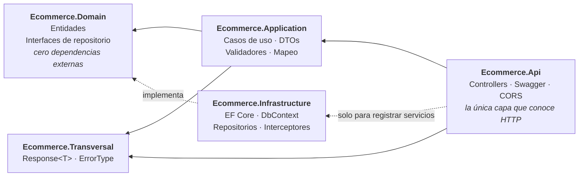

# Backend Portfolio — API Ecommerce

API REST en **.NET 10** construida con **Clean Architecture**, como proyecto de portfolio y aprendizaje
deliberado de backend en C#.

El objetivo no es la cantidad de funcionalidad, sino la **calidad de las decisiones**: por qué cada pieza
está donde está, qué problema resuelve y qué se rompería si estuviera en otro sitio. El código lleva
comentarios que explican el *porqué*, no el *qué* — están puestos a propósito, con fines didácticos, y en
un proyecto de producción tendrían bastante menos densidad.

---

## Arquitectura

Clean Architecture / Onion, con la regla de dependencia como única norma innegociable: **las dependencias
apuntan siempre hacia dentro**, hacia lo que menos cambia.



La prueba de que la regla se cumple no está en la estructura de carpetas, sino en los `.csproj`:
**`Ecommerce.Domain` no tiene un solo `PackageReference`**. Las interfaces de repositorio viven ahí — en
quien las *usa* — y `Infrastructure` las implementa; ahí está la inversión de dependencias.

| Proyecto | Responsabilidad |
|---|---|
| `Ecommerce.Api` | Traduce HTTP ↔ casos de uso. Composition root. |
| `Ecommerce.Application` | Orquesta los casos de uso. No sabe qué es un código HTTP. |
| `Ecommerce.Domain` | Entidades y contratos. No sabe que existe una base de datos. |
| `Ecommerce.Infrastructure` | Persistencia con EF Core. Implementa los contratos del dominio. |
| `Ecommerce.Transversal` | Tipos compartidos por varias capas (`Response<T>`, `ErrorType`). |
| `Ecommerce.Test` | xUnit + NSubstitute + EF Core InMemory. |

---

## Stack

- **.NET 10** · C# · ASP.NET Core Web API
- **Entity Framework Core 10** (Code First) sobre **SQL Server**
- **FluentValidation** — validación desacoplada del modelo
- **AutoMapper** — mapeo entidad ↔ DTO
- **Swashbuckle / OpenAPI** — documentación con anotaciones y comentarios XML
- **xUnit · NSubstitute · Coverlet** — tests y cobertura

---

## Puesta en marcha

**Requisitos:** SDK de .NET 10 y una instancia de SQL Server (vale SQL Server Express).

```bash
git clone https://github.com/rubendevvalencia/BackendPortfolio.git
cd BackendPortfolio
```

**1. Configura la cadena de conexión.** `appsettings.json` declara la clave pero la deja vacía a
propósito: el archivo define la *forma* de la configuración, no sus valores. El valor real nunca entra
en el repositorio.

```bash
dotnet user-secrets set "ConnectionStrings:EcommerceDb" \
  "Server=localhost\SQLEXPRESS;Database=Ecommerce;Trusted_Connection=True;TrustServerCertificate=True;" \
  --project Ecommerce
```

En despliegue se usa la variable de entorno `ConnectionStrings__EcommerceDb` (el doble guion bajo es el
separador de claves anidadas). Si falta la cadena, la aplicación falla al arrancar con el comando exacto
a ejecutar, en lugar de dar un error opaco más tarde.

**2. Crea la base de datos.**

```bash
dotnet ef database update --project Ecommerce.Infrastructure --startup-project Ecommerce
```

**3. Arranca.**

```bash
dotnet run --project Ecommerce
```

Swagger queda en `https://localhost:7051/swagger`.

**Tests:**

```bash
dotnet test
```

La solución (`Ecommerce.slnx`) está en la raíz del repositorio, así que `dotnet build`,
`dotnet test` y `dotnet sln list` funcionan sin indicarle la ruta.

---

## Endpoints

Todos bajo `api/Customer`, y todos devuelven un `Response<T>` con el mismo contrato.

| Verbo | Ruta | Descripción |
|---|---|---|
| `GET` | `/GetAllAsync` | Lista todos los clientes |
| `GET` | `/GetByIdAsync/{id}` | Recupera un cliente |
| `POST` | `/AddAsync` | Crea un cliente |
| `PUT` | `/UpdateAsync{id}` | Actualiza un cliente |
| `POST` | `/UpdateAsyncPost/{id}` | Igual que el anterior, para clientes que no admiten `PUT` |
| `DELETE` | `/DeleteAsync/{id}` | Elimina un cliente |

---

## Decisiones técnicas

Las que tienen algo que explicar. El resto del código intenta ser aburrido a propósito.

### `Response<T>` en lugar de excepciones

Que un cliente no exista o que un DTO no valide **no es excepcional**: es un resultado previsto del caso
de uso. Modelarlo con excepciones sale caro en rendimiento, esconde el flujo de control y obliga a un
`try/catch` en cada llamador. Aquí el fallo esperado forma parte del valor de retorno, y por tanto de la
firma del método.

La segunda mitad es la que lo convierte en arquitectura: **`Application` dice *qué* falló, `Api` decide
*cómo* se comunica.** Por eso existe un `enum ErrorType` y no un `int statusCode` — la capa de aplicación
no sabe qué es un 404. Si mañana estos casos de uso se expusieran por gRPC o por una cola, `Application`
no se toca; solo se escribe otro traductor.

### Auditoría con un interceptor de `SaveChanges`

`CreatedAt`, `CreatedBy`, `LastUpdatedAt` y `LastUpdatedBy` los rellena un `SaveChangesInterceptor` que
recorre el `ChangeTracker`. Como *todos* los cambios pasan por `SaveChanges`, hay un punto único donde
resolver una preocupación que afecta a todas las entidades — en lugar de repetir las mismas cuatro líneas
en cada repositorio.

### Mapeo manual en la actualización

El alta usa AutoMapper, pero la actualización usa un mapeo manual escrito a mano
(`ManualMappingCustomer.MapInto`), y es deliberado: copia el DTO **encima** de la entidad ya cargada, que
sigue *connected* en el `ChangeTracker`. EF genera entonces un `UPDATE` solo con las columnas que de
verdad cambiaron. Mapear a una instancia nueva la dejaría *detached* y perdería esa detección.

### CORS fuera del `if (IsDevelopment())`

`UseCors()` se registra siempre, no solo en desarrollo: si estuviera dentro del `if`, en producción las
respuestas saldrían sin la cabecera `Access-Control-Allow-Origin`. El fallo es difícil de diagnosticar
porque **CORS lo aplica el navegador, no el servidor** — la API responde 200, los logs se ven bien y desde
curl o Postman funciona, pero el navegador oculta la respuesta al JavaScript.

Su posición en el pipeline es la canónica: después de `UseHttpsRedirection()` y antes de
`UseAuthorization()`, para que el preflight `OPTIONS` se responda antes de que nadie exija autenticación.
Y va precedido de `UseForwardedHeaders()`, porque cuando el TLS termina en un balanceador la aplicación
recibe HTTP plano y `UseHttpsRedirection()` respondería 307 incluso a los preflight.

### Tests: qué se prueba y con qué

`DbContextEF` hereda de `DbContext` y no expone miembros virtuales, así que **no se puede sustituir con un
mock**. Los tests de repositorio usan el proveedor InMemory de EF Core, con una base distinta por test y
un patrón de **dos contextos**: se escribe con uno y se lee con otro, de modo que la lectura venga del
almacén y no del `ChangeTracker`. Es la diferencia entre probar que algo persiste y probar que algo se
quedó en memoria.

`ConfigureServicesTest` prueba el **composition root**: construye el contenedor con
`BuildServiceProvider(validateScopes: true)` y resuelve el grafo completo. Detecta la clase de error que
no rompe la compilación ni la suite, pero sí el arranque de la aplicación — un `AddScoped` olvidado, o una
*captive dependency* (un singleton que atrapa el `DbContext` scoped).

---

## Estado actual y limitaciones conocidas

Este es un proyecto en construcción y prefiero decir dónde está el trabajo pendiente a que se descubra
leyendo. Lo que sé que falta, por orden de prioridad:

| | Pendiente |
|---|---|
| 1 | **La capa `Application` no tiene tests.** El proyecto de test aún no la referencia, así que ni siquiera aparece en el informe de cobertura. Es la siguiente tarea. |
| 2 | **El Unit of Work está a medias.** `IUnitOfWork` agrupa los repositorios pero no expone `SaveChangesAsync`, y los repositorios confirman por su cuenta. Funciona con una sola entidad; deja de funcionar en cuanto un caso de uso tenga que escribir en dos tablas de forma atómica. |
| 3 | **`PUT` idempotente devuelve 500.** Actualizar con los mismos datos afecta a 0 filas, el repositorio devuelve `false` y se traduce a error. El `bool` significa dos cosas a la vez; se resuelve al completar el punto 2. |
| 4 | Sin middleware global de excepciones: cada caso de uso repite su `try/catch`. |
| 5 | Sin autenticación ni autorización real, sin logging estructurado y sin paginación en `GetAllAsync`. |
| 6 | Rutas con el verbo en la URL (`api/Customer/AddAsync`) en lugar de REST puro, y un único DTO para crear, actualizar y leer. |

**Cobertura:** ~92 % de líneas sobre el código escrito a mano de `Infrastructure` y `Domain`
(el porcentaje global del informe es más bajo porque incluye las migraciones autogeneradas de EF).
`Application`, `Transversal` y `Api` todavía no están medidas.

---

## Licencia

Proyecto personal de aprendizaje, sin licencia de uso definida.
