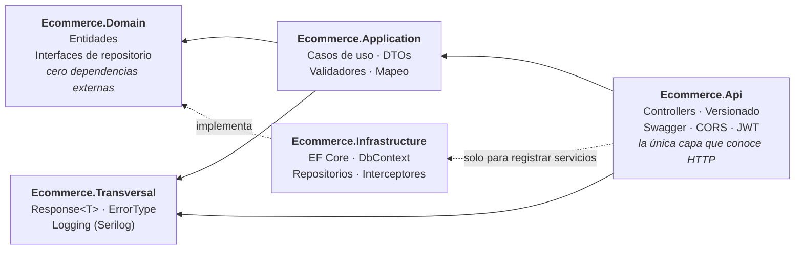

# Backend Portfolio — API Ecommerce

API REST en **.NET 10** construida con **Clean Architecture**, como proyecto de portfolio y aprendizaje
deliberado de backend en C#.

El objetivo no es la cantidad de funcionalidad, sino la **calidad de las decisiones**: por qué cada pieza
está donde está, qué problema resuelve y qué se rompería si estuviera en otro sitio. El código lleva
comentarios que explican el *porqué*, no el *qué* — están puestos a propósito, con fines didácticos, y en
un proyecto de producción tendrían bastante menos densidad.

---

## Arquitectura

Clean Architecture / Onion, con la regla de dependencia como única norma innegociable: **las dependencias
apuntan siempre hacia dentro**, hacia lo que menos cambia.



La prueba de que la regla se cumple no está en la estructura de carpetas, sino en los `.csproj`:
**`Ecommerce.Domain` no tiene un solo `PackageReference`**. Las interfaces de repositorio viven ahí — en
quien las *usa* — y `Infrastructure` las implementa; ahí está la inversión de dependencias.

| Proyecto | Responsabilidad |
|---|---|
| `Ecommerce.Api` | Traduce HTTP ↔ casos de uso. Versionado, autenticación, Swagger. Composition root. |
| `Ecommerce.Application` | Orquesta los casos de uso. No sabe qué es un código HTTP. |
| `Ecommerce.Domain` | Entidades y contratos. No sabe que existe una base de datos. |
| `Ecommerce.Infrastructure` | Persistencia con EF Core. Implementa los contratos del dominio. |
| `Ecommerce.Transversal` | Tipos y servicios compartidos por varias capas (`Response<T>`, `ErrorType`, logging). |
| `Ecommerce.Test` | xUnit + NSubstitute + EF Core InMemory. |

---

## Stack

- **.NET 10** · C# · ASP.NET Core Web API
- **Entity Framework Core 10** (Code First) sobre **SQL Server**
- **Asp.Versioning** — versionado de la API por segmento de URL
- **JWT Bearer** — autenticación con `Microsoft.AspNetCore.Authentication.JwtBearer`
- **FluentValidation** — validación desacoplada del modelo
- **AutoMapper** — mapeo entidad ↔ DTO
- **Serilog** — logging estructurado a consola, fichero y SQL Server
- **Swashbuckle / OpenAPI** — documentación con anotaciones, un documento por versión
- **xUnit · NSubstitute · Coverlet** — tests y cobertura

---

## Versionado de la API

La API se versiona **por segmento de URL**: la versión viaja en la propia ruta, `api/v1/...` y `api/v2/...`.

### Cómo está montado

Tres piezas, cada una en su sitio:

| Archivo | Papel |
|---|---|
| `Ecommerce/Models/Version/VersionExtensions.cs` | Registra el versionado y el API Explorer |
| `Ecommerce/Models/Swagger/ConfigureSwaggerOptions.cs` | Genera **un documento de Swagger por versión** descubierta |
| `Ecommerce/Program.cs` | Recorre las versiones y publica un endpoint de Swagger UI por cada una |

```csharp
services.AddApiVersioning(options =>
{
    options.DefaultApiVersion = new ApiVersion(1, 0);
    options.ReportApiVersions = true;                    // cabeceras api-supported-versions / api-deprecated-versions
    options.ApiVersionReader = ApiVersionReader.Combine(
        new UrlSegmentApiVersionReader());
}).AddApiExplorer(options =>
{
    options.GroupNameFormat = "'v'VVV";                  // v1, v2, v1.1...
    options.SubstituteApiVersionInUrl = true;            // sustituye {version} por el valor real en la doc
});
```

Los controllers declaran su versión con atributos y la plantilla de ruta lleva el parámetro:

```csharp
[Route("api/v{version:apiVersion}/[controller]")]
[ApiVersion("2.0")]
public class CustomerController : ControllerBase
```

### Por qué segmento de URL y no cabecera

Hay cuatro estrategias posibles y `Asp.Versioning` las soporta todas — las tres alternativas están
comentadas en `VersionExtensions.cs` a propósito, para dejar constancia de que la elección fue consciente:

| Estrategia | Ventaja | Inconveniente |
|---|---|---|
| **Segmento de URL** (elegida) | Visible, cacheable, se prueba desde el navegador o curl sin herramientas | La versión ensucia la URL; ortodoxamente la URI debería identificar el recurso, no su representación |
| Query string (`?api-version=2.0`) | No ensucia la ruta | Fácil de olvidar; problemas de caché |
| Cabecera (`X-Version: 2.0`) | URL limpia, es lo más "correcto" según REST | Invisible; no se puede probar pegando una URL en el navegador |
| Media type (`Accept: ...;ver=2.0`) | El más purista | El más incómodo de consumir y de documentar |

Para un proyecto cuyo objetivo es **enseñar y que se entienda leyéndolo**, la visibilidad gana a la
ortodoxia. En una API interna con clientes generados, la cabecera sería la elección razonable.

### Swagger por versión

El punto que hace que esto no sea trabajo manual: `ConfigureSwaggerOptions` implementa
`IConfigureOptions<SwaggerGenOptions>` y **recorre `IApiVersionDescriptionProvider`**, así que crea un
documento por cada versión que descubra en los controllers. No hay ningún `SwaggerDoc("v1", ...)` escrito
a mano — añadir una v3 no obliga a tocar la configuración de Swagger.

`Program.cs` hace lo simétrico en la UI: resuelve el provider desde `app.Services` (en lugar de construir
un contenedor nuevo) y publica un `SwaggerEndpoint` por versión, que es lo que produce el desplegable de
versiones arriba a la derecha en `/swagger`.

Las versiones marcadas como obsoletas lo llevan en el atributo, y eso viaja a dos sitios: a la descripción
del documento de Swagger y a la cabecera `api-deprecated-versions` de cada respuesta.

```csharp
[ApiVersion("1.0", Deprecated = true)]
```

### Qué diferencia a v1 de v2

Las dos versiones exponen **la misma superficie HTTP** — mismos endpoints, mismos DTOs, mismas respuestas.
Lo que cambia es lo que hay detrás, y ese es el motivo de que exista el ejemplo:

| | v1 | v2 |
|---|---|---|
| Caso de uso | `CustomerApplication` | `CustomerApplicationUoW` |
| Dependencia | `ICustomerRepository` directo | `IUnitOfWork` |
| Quién confirma | **cada repositorio**, en cada método | **el caso de uso**, una sola vez |
| `SaveChangesAsync` por petición | uno por operación de repositorio | exactamente uno |
| Estado | `Deprecated = true` | vigente |

**v1 es el antipatrón, deliberadamente.** Cada método del repositorio hace su propio `SaveChanges`, así que
el límite transaccional vive en la capa de persistencia. Funciona mientras cada caso de uso toque una sola
entidad — y deja de funcionar en cuanto haya que escribir en dos tablas de forma atómica, porque la primera
escritura ya está confirmada cuando falla la segunda.

**v2 aplica el patrón como toca.** Se ve en las firmas de `IBaseRepositoryUoW`:

```csharp
Task AddAsync(T entity, CancellationToken cancellationToken = default);  // Task, no Task<bool>
void Update(T entity);                                                    // void: no confirma
void Delete(T entity);                                                    // recibe la ENTIDAD, no el id
```

Los tres detalles importan:

- **`AddAsync` devuelve `Task`** y no `Task<bool>`: el repositorio no puede informar del resultado porque
  todavía no ha pasado nada. Solo ha registrado la intención en el `ChangeTracker`.
- **`Update` y `Delete` son `void`** por lo mismo. Si devolvieran algo, ese algo sería mentira.
- **`Delete` recibe la entidad y no el id.** Comprobar si existe es una decisión del caso de uso, no del
  repositorio, y así queda separado el *"no existe"* (404) del *"no se pudo borrar"* (500). Con la firma
  anterior (`DeleteAsync(int id)` devolviendo `bool`) ese `bool` significaba las dos cosas a la vez.

Que ambas versiones convivan es lo que hace legible el contraste: el mismo endpoint, el mismo DTO, y dos
formas distintas de decidir dónde empieza y acaba una transacción.

> **Nota sobre nombres.** El sufijo `UoW` (`ICustomerApplicationUoW`, `CustomerRepositoryUoW`,
> `_customersUoW`) existe solo para que las dos versiones convivan durante el ejemplo. Un tipo no debe
> nombrarse por el patrón que usa por dentro: cuando la v1 se retire, el sufijo desaparece.

Para el caso contrario —cuando el contrato **no** cambia— no hace falta duplicar nada. Basta con declarar
las dos versiones sobre la misma clase, como hace el controller de autenticación:

```csharp
// Controllers/UserAuthController.cs — una clase, dos versiones
[ApiVersion("1.0", Deprecated = true)]
[ApiVersion("2.0")]
public class UserAuthController : ControllerBase
```

---

## Puesta en marcha

**Requisitos:** SDK de .NET 10 y una instancia de SQL Server (vale SQL Server Express).

```bash
git clone https://github.com/rubendevvalencia/BackendPortfolio.git
cd BackendPortfolio
```

**1. Configura los secretos.** `appsettings.json` declara las claves pero las deja vacías a propósito: el
archivo define la *forma* de la configuración, no sus valores. Los valores reales nunca entran en el
repositorio.

```bash
dotnet user-secrets set "ConnectionStrings:EcommerceDb" \
  "Server=localhost\SQLEXPRESS;Database=Ecommerce;Trusted_Connection=True;TrustServerCertificate=True;" \
  --project Ecommerce

dotnet user-secrets set "Jwt:Key" "<clave aleatoria de 32 bytes o mas>" --project Ecommerce
```

La clave JWT no es opcional: `JwtApplication` falla con un mensaje explícito si falta o si tiene menos de
32 bytes. HMAC-SHA256 exige 256 bits, y el límite se mide en bytes, no en caracteres — una frase escrita a
mano no sirve.

En despliegue ambos valores llegan por variables de entorno: `ConnectionStrings__EcommerceDb` y `Jwt__Key`
(el doble guion bajo es el separador de claves anidadas).

**2. Crea la base de datos.**

```bash
dotnet ef database update --project Ecommerce.Infrastructure --startup-project Ecommerce
```

**3. Arranca.**

```bash
dotnet run --project Ecommerce
```

Swagger queda en `https://localhost:7051/swagger`, con el desplegable de versiones arriba a la derecha.

**Tests:**

```bash
dotnet test
```

La solución (`Ecommerce.slnx`) está en la raíz del repositorio, así que `dotnet build`, `dotnet test` y
`dotnet sln list` funcionan sin indicarle la ruta.

---

## Endpoints

Todos devuelven un `Response<T>` con el mismo contrato. `{v}` es `1` o `2`.

### Autenticación — `api/v{v}/UserAuth`

Un solo controller sirviendo ambas versiones. Los dos endpoints son `[AllowAnonymous]`; el resto de la API
exige un JWT válido en la cabecera `Authorization: Bearer <token>`.

| Verbo | Ruta | Descripción |
|---|---|---|
| `POST` | `/SignUp` | Registra un usuario |
| `POST` | `/SignIn` | Devuelve un token de acceso |

### Clientes — `api/v{v}/Customer`

Mismos endpoints en las dos versiones; lo que cambia es la implementación detrás (ver *Qué diferencia a v1
de v2*). **v1 está marcada como obsoleta**: usa el enfoque sin Unit of Work, que se conserva a propósito
como término de comparación.

| Verbo | Ruta | Descripción |
|---|---|---|
| `GET` | `/GetAllAsync` | Lista todos los clientes |
| `GET` | `/GetByIdAsync/{id}` | Recupera un cliente |
| `POST` | `/AddAsync` | Crea un cliente |
| `PUT` | `/UpdateAsync{id}` | Actualiza un cliente |
| `POST` | `/UpdateAsyncPost/{id}` | Igual que el anterior, para clientes que no admiten `PUT` |
| `DELETE` | `/DeleteAsync/{id}` | Elimina un cliente |

> Las rutas llevan el verbo dentro de la URL en lugar de seguir REST puro (`POST api/v2/customers`), y
> `UpdateAsync{id}` además genera una ruta sin separador. Está en la lista de pendientes de abajo: se
> arreglará junto con la fusión de los dos controllers, para no tocar los mismos archivos dos veces.

---

## Decisiones técnicas

Las que tienen algo que explicar. El resto del código intenta ser aburrido a propósito.

### `Response<T>` en lugar de excepciones

Que un cliente no exista o que un DTO no valide **no es excepcional**: es un resultado previsto del caso
de uso. Modelarlo con excepciones sale caro en rendimiento, esconde el flujo de control y obliga a un
`try/catch` en cada llamador. Aquí el fallo esperado forma parte del valor de retorno, y por tanto de la
firma del método.

La segunda mitad es la que lo convierte en arquitectura: **`Application` dice *qué* falló, `Api` decide
*cómo* se comunica.** Por eso existe un `enum ErrorType` y no un `int statusCode` — la capa de aplicación
no sabe qué es un 404. Si mañana estos casos de uso se expusieran por gRPC o por una cola, `Application`
no se toca; solo se escribe otro traductor.

### Unit of Work: quién decide cuándo se confirma

El patrón no sirve para "agrupar repositorios" — eso es una consecuencia, no el objetivo. Sirve para
**mover el límite transaccional desde la capa de persistencia hasta el caso de uso**, que es la única que
sabe qué conjunto de cambios forma una unidad indivisible.

La pieza que lo hace posible no está en el código del `UnitOfWork`, sino en el registro de servicios: el
`DbContext` está registrado como **Scoped**, así que `UnitOfWork` y todos los repositorios comparten la
*misma* instancia durante toda la petición. Ese contexto compartido es lo que permite que un único
`SaveChangesAsync` confirme en bloque los cambios registrados desde varios repositorios distintos, dentro
de una sola transacción.

De ahí sale una regla que atraviesa todo el diseño: **si el repositorio no confirma, tampoco puede
informar del resultado.** Por eso `Update` y `Delete` devuelven `void` y `AddAsync` devuelve `Task`. Un
repositorio que devolviera `bool` estaría afirmando algo que todavía no ha ocurrido.

Y una consecuencia práctica que conviene entender porque es contraintuitiva: **cuando `SaveChangesAsync`
devuelve 0, no ha fallado nada.** Significa que EF no encontró diferencias que escribir — actualizar un
registro con los mismos valores es el caso típico. Con la comprobación de existencia hecha antes por el
caso de uso, un 0 es una operación correcta sin efecto, no un error. Derivar el éxito del número de filas
afectadas es precisamente lo que el patrón permite dejar de hacer.

La comparación entre hacerlo y no hacerlo está montada en el propio repositorio, en las dos versiones de
la API: ver *Qué diferencia a v1 de v2*, más arriba.

### Autenticación con JWT

La firma y la validación comparten la sección `Jwt` de la configuración, para que el `Issuer`, la
`Audience` y la clave no puedan desincronizarse entre quien emite el token y quien lo valida.
`ClockSkew = TimeSpan.Zero` elimina el margen de 5 minutos que .NET añade por defecto a la caducidad.

`Issuer` y `Audience` **no son secretos** y viven en `appsettings.json`: viajan dentro del propio token y
cualquiera que lo reciba los ve. Solo la clave firma, y por eso es la única que sale del control de
versiones.

El hash de contraseñas usa `IPasswordHasher<T>` de ASP.NET Core Identity — PBKDF2 con salt por usuario,
sin escribir criptografía a mano.

### Auditoría con un interceptor de `SaveChanges`

`CreatedAt`, `CreatedBy`, `LastUpdatedAt` y `LastUpdatedBy` los rellena un `SaveChangesInterceptor` que
recorre el `ChangeTracker`. Como *todos* los cambios pasan por `SaveChanges`, hay un punto único donde
resolver una preocupación que afecta a todas las entidades — en lugar de repetir las mismas cuatro líneas
en cada repositorio.

### Mapeo manual en la actualización

El alta usa AutoMapper, pero la actualización usa un mapeo manual escrito a mano
(`ManualMappingCustomer.MapInto`), y es deliberado: copia el DTO **encima** de la entidad ya cargada, que
sigue *connected* en el `ChangeTracker`. EF genera entonces un `UPDATE` solo con las columnas que de
verdad cambiaron. Mapear a una instancia nueva la dejaría *detached* y perdería esa detección.

### CORS fuera del `if (IsDevelopment())`

`UseCors()` se registra siempre, no solo en desarrollo: si estuviera dentro del `if`, en producción las
respuestas saldrían sin la cabecera `Access-Control-Allow-Origin`. El fallo es difícil de diagnosticar
porque **CORS lo aplica el navegador, no el servidor** — la API responde 200, los logs se ven bien y desde
curl o Postman funciona, pero el navegador oculta la respuesta al JavaScript.

Su posición en el pipeline es la canónica: después de `UseHttpsRedirection()` y antes de
`UseAuthorization()`, para que el preflight `OPTIONS` se responda antes de que nadie exija autenticación.
Y va precedido de `UseForwardedHeaders()`, porque cuando el TLS termina en un balanceador la aplicación
recibe HTTP plano y `UseHttpsRedirection()` respondería 307 incluso a los preflight.

### Logging con Serilog

Tres destinos con criterios distintos: consola para desarrollo, fichero rotado a diario (7 días) para el
histórico local, y **SQL Server solo a partir de `Warning`** — la tabla de logs no debe llenarse con el
tráfico normal.

`UseSerilogRequestLogging()` va antes de la autenticación en el pipeline, a propósito: así registra
también los intentos que acaban en 401.

### Tests: qué se prueba y con qué

`DbContextEF` hereda de `DbContext` y no expone miembros virtuales, así que **no se puede sustituir con un
mock**. Los tests de repositorio usan el proveedor InMemory de EF Core, con una base distinta por test y
un patrón de **dos contextos**: se escribe con uno y se lee con otro, de modo que la lectura venga del
almacén y no del `ChangeTracker`. Es la diferencia entre probar que algo persiste y probar que algo se
quedó en memoria.

`ConfigureServicesTest` prueba el **composition root**: construye el contenedor con
`BuildServiceProvider(validateScopes: true)` y resuelve el grafo completo. Detecta la clase de error que
no rompe la compilación ni la suite, pero sí el arranque de la aplicación — un `AddScoped` olvidado, o una
*captive dependency* (un singleton que atrapa el `DbContext` scoped).

---

## Estado actual y limitaciones conocidas

Este es un proyecto en construcción y prefiero decir dónde está el trabajo pendiente a que se descubra
leyendo. Lo que sé que falta, por orden de prioridad:

| | Pendiente |
|---|---|
| 1 | **El Unit of Work está a medias: `IUserRepository` confirma por su cuenta.** `IUnitOfWork` expone dos repositorios y solo uno respeta el patrón — `UserRepository.CreateUserAsync` llama a `SaveChangesAsync` internamente. Quien lea `_unitOfWork.X()` asume que nada se confirma hasta pedirlo, y en esa mitad no es cierto. Es el fallo más sutil del repositorio y el siguiente a arreglar. |
| 2 | **`PUT` idempotente devuelve 500.** Actualizar con los mismos datos hace que EF no escriba nada, `SaveChangesAsync` devuelve 0 y el caso de uso lo traduce a error. Ahora que la existencia se comprueba por separado, un 0 debe leerse como éxito sin efecto. |
| 3 | **La capa `Application` no tiene tests.** El proyecto de test aún no la referencia. Pesa más desde que hay Unit of Work: *"si algo falla no se confirma nada"* es una propiedad que solo se puede demostrar ejecutándola, no leyendo el código. |
| 4 | **El test del composition root no cubre los registros nuevos.** `ICustomerRepositoryUoW` no aparece ni en los `Assert` ni en los `[InlineData]` que verifican el lifetime. Ese test existe justo para cazar un `AddScoped` olvidado. |
| 5 | **Sin healthcheck.** Prerrequisito del despliegue: `/health/live` y `/health/ready` separados, para que una caída transitoria de la base de datos no provoque el reinicio de un proceso sano. |
| 6 | **Sin middleware global de excepciones.** Cada caso de uso repite su `try/catch` y el detalle de la excepción acaba en la respuesta HTTP, que no debe salir del servidor. |
| 7 | **`EnableSensitiveDataLogging()` está activo en todos los entornos**, no solo en desarrollo. Debe condicionarse antes de cualquier despliegue. |
| 8 | **`DefaultApiVersion` apunta a `1.0`, que está marcada como obsoleta.** Quien no especifique versión cae en la deprecada. Debe pasar a `2.0`. |
| 9 | Rutas con el verbo en la URL (`api/v2/Customer/AddAsync`) en lugar de REST puro, y un único DTO para crear, actualizar y leer. |
| 10 | Sin paginación en `GetAllAsync`, sin refresh token y sin claims de rol (`[Authorize]` es todo-o-nada). |

Cuando la v1 se retire, con ella se van el sufijo `UoW` de los nombres de tipo y la duplicación de
`CustomerController`, que hoy están justificados por el ejemplo.

**Build y tests:** compila sin errores; **23 tests en verde**. Los warnings `CS1591` (comentario XML
ausente) son ruido de tener `GenerateDocumentationFile` activo mientras se documenta con anotaciones de
Swagger en lugar de con `///`.

**Cobertura:** ~92 % de líneas sobre el código escrito a mano de `Infrastructure` y `Domain`
(el porcentaje global del informe es más bajo porque incluye las migraciones autogeneradas de EF).
`Application`, `Transversal` y `Api` todavía no están medidas.

---

## Hoja de ruta

Bloques en el orden en que se van a abordar. El criterio: lo que modifica el contrato público va antes que
lo que lo publica, porque una vez publicado, cambiarlo es un *breaking change*.

| Bloque | Contenido | Estado |
|---|---|---|
| **A** | Versionado de la API · limpieza de rutas a REST · healthcheck | 🟡 Versionado hecho |
| **B** | Unit of Work · middleware global de excepciones · `EnableSensitiveDataLogging` por entorno | 🟡 Unit of Work hecho en `Customer`; falta `IUserRepository` |
| **C** | Tests de `Application` · CQRS con MediatR y sus *pipeline behaviors* | ⬜ |
| **D** | Modelado relacional (`Order` → `OrderLine`) · paginación · Postgres | ⬜ |
| **E** | Dockerfile · GitHub Actions · despliegue en Azure | ⬜ |

El bloque C tiene un orden interno que importa: **los tests van antes que MediatR**. Escritos contra las
interfaces actuales describen el comportamiento de hoy, y son los que verifican que la migración a
handlers no cambia nada por el camino. Escritos después, se estarían escribiendo mirando el código nuevo y
no protegerían de nada.

El valor de MediatR aquí no está en los handlers —con un dominio de una entidad, `CreateCustomerCommand`
es burocracia sobre lo que ya hay— sino en los *pipeline behaviors*, que resuelven problemas que este
repositorio tiene ahora mismo: `ValidationBehavior` saca FluentValidation de dentro de cada caso de uso,
`TransactionBehavior` mueve el `SaveChangesAsync` al borde del pipeline, y `UnhandledExceptionBehavior`
elimina los `try/catch` repetidos y la fuga del mensaje de excepción.

---

## Licencia

Proyecto personal de aprendizaje, sin licencia de uso definida.
