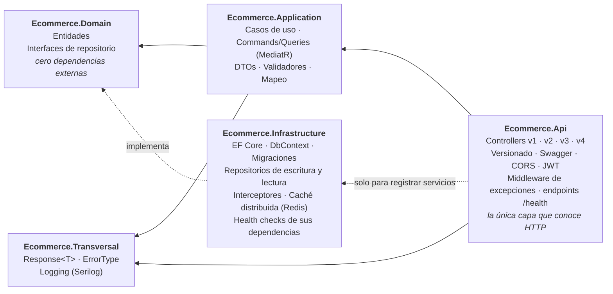

# Backend Portfolio — API Ecommerce

> [!IMPORTANT]
> **Portfolio de aprendizaje y demostración de conocimientos adquiridos a lo largo de mi experiencia profesional.**
>
> No es un producto. Tiene dos propósitos que conviven: **demostrar** lo que he aprendido trabajando en
> backend con .NET, y **seguir aprendiendo** a la vista, probando patrones, comparándolos y dejando
> documentado lo que no sale bien. No está pensado para producción. Tiene **29 limitaciones conocidas** (de seguridad, corrección,
> diseño e higiene) documentadas en [*Estado actual y limitaciones conocidas*](docs/limitaciones.md),
> con el motivo de cada una. Si vas a evaluarlo, ese documento forma parte del proyecto tanto como el código:
> muestra qué sé que falta y en qué orden pienso resolverlo.

> **En 30 segundos**
>
> - **Qué es:** portfolio de aprendizaje y demostración de conocimientos adquiridos en mi experiencia profesional. API REST en **.NET 10** con **Clean Architecture** (5 capas + tests), autenticación **JWT** y **EF Core 10** sobre SQL Server.
> - **Qué la diferencia:** el mismo recurso implementado en **cuatro versiones de la API que conviven**: Repository → Unit of Work → **CQRS con MediatR** → validación en el pipeline. Así cada decisión se puede comparar en código que funciona.
> - **Patrones:** CQRS con repositorios de lectura y escritura separados · Unit of Work · *pipeline behaviors* (logging y validación) · *Result pattern* (`Response<T>`) + middleware global de excepciones.
> - **Transversal:** versionado por URL con un documento Swagger por versión · Serilog a consola, fichero y SQL Server según el nivel · auditoría con un interceptor de EF Core · rate limiting con ventana fija y caché distribuida con Redis (ambos, versión simplificada de prueba) · health checks registrados en `Infrastructure` y expuestos en `Api` · secretos fuera del repositorio · integración continua en GitHub Actions: build, 269 tests y escaneo de secretos con gitleaks en cada push y PR.
> - **[Tests](docs/tests.md):** 269 con xUnit, NSubstitute y EF Core InMemory: repositorios, handlers, validadores, behaviours y la configuración de dependencias.
> - **Stack:** C# · ASP.NET Core · EF Core · SQL Server · Redis · MediatR · FluentValidation · AutoMapper · JWT · Serilog · Swagger · xUnit
> - **Por dónde empezar:** [`Controllers/v1`](Ecommerce/Controllers/v1/CustomerController.cs) → [`v4`](Ecommerce/Controllers/v4/CustomerController.cs) y la tabla de [*Cómo leer este repositorio*](#cómo-leer-este-repositorio).
> - **Trabajo pendiente, a la vista:** 29 limitaciones conocidas (de 31 anotadas, dos ya resueltas) en [docs/limitaciones.md](docs/limitaciones.md), con el mecanismo de cada fallo explicado, y la [hoja de ruta](#hoja-de-ruta) al final: invalidación de la caché, tests de integración, Docker y despliegue, dominio rico.

API REST en **.NET 10** construida con **Clean Architecture**: un portfolio de aprendizaje y de
demostración de los conocimientos de backend en C# que he adquirido a lo largo de mi experiencia profesional.

El objetivo no es la cantidad de funcionalidad, sino la **calidad de las decisiones**: por qué cada pieza
está donde está, qué problema resuelve y qué se rompería si estuviera en otro sitio.

Que sea un proyecto de aprendizaje tiene consecuencias concretas, y conviene tenerlas presentes al leerlo:

- **Algunos contrastes están puestos a propósito.** v1 es el antipatrón y v4 usa una excepción para un
  fallo esperado. Conviven con las demás versiones para poder compararlas, no por descuido.
- **Algunas piezas son ejercicios, no soluciones.** El rate limiter y la caché con Redis son versiones
  simplificadas para ver el patrón funcionando de punta a punta; no responden a un problema medido.
- **Los comentarios son didácticos.** Explican el *porqué* y no el *qué*, y en un proyecto de producción
  tendrían bastante menos densidad.
- **Hay deuda, y está a la vista.** Todo lo que sé que falla o falta está en
  [*Estado actual y limitaciones conocidas*](docs/limitaciones.md), con el mecanismo de
  cada fallo explicado, y el orden en que se va a abordar está en la [*Hoja de ruta*](#hoja-de-ruta).

---

## Cómo leer este repositorio

**El mismo recurso (`Customer`) está implementado cuatro veces, una por versión de la API.** No es
duplicación accidental: cada versión resuelve el mismo caso de uso con un enfoque distinto, y que convivan
es lo que permite evaluar la evolución completa desde la propia API — mismo recurso, cuatro formas de decidir
dónde vive la transacción, cómo se separan lecturas y escrituras y dónde se valida.

| | **v1** | **v2** | **v3** | **v4** |
|---|---|---|---|---|
| Enfoque | Repositorio directo | Unit of Work | CQRS con MediatR | CQRS + validación en el pipeline |
| Quién confirma (`SaveChanges`) | Cada método del repositorio | El caso de uso, una vez | El handler, una vez | El handler, una vez |
| Lecturas | Mismo repositorio | Mismo repositorio | Repositorio de lectura separado | Repositorio de lectura separado |
| Controller depende de | `ICustomerApplication` | `ICustomerApplicationUoW` | Solo `IMediator` | Solo `IMediator` |
| Dónde se valida | Caso de uso | Caso de uso | Handler → `Response.Invalid` | `ValidationBehaviour` → excepción → middleware |
| Detección de duplicados | No | Sí → 409 | Sí → 409 | Sí → 409 |
| Qué demuestra | **El antipatrón**, a propósito | El límite transaccional en el caso de uso | Separación de comandos y consultas | La validación como preocupación transversal |
| Estado | `Deprecated` | Vigente | Vigente | Vigente |

> **Una advertencia sobre la comparación.** v3 y v4 comparten `ICustomerReadRepository`, así que la caché
> que se añadió sobre el listado entró en las dos a la vez. La tabla compara *dónde se valida*, y eso sigue
> siendo exacto; pero en `GetAllAsync` las dos versiones se comportan hoy igual y las dos arrastran la misma
> falta de invalidación. Cualquier pieza que se añada al lado de lectura afecta a ambas: conviene que sea una
> decisión consciente y no un efecto colateral. Ver [pendientes nº 24 y 28](docs/limitaciones.md).

Recorrido recomendado: [`Controllers/v1`](Ecommerce/Controllers/v1/CustomerController.cs) →
[`v2`](Ecommerce/Controllers/v2/CustomerController.cs) → [`v3`](Ecommerce/Controllers/v3/CustomerController.cs) →
[`v4`](Ecommerce/Controllers/v4/CustomerController.cs), y detrás de cada uno su implementación en
[`Ecommerce.Application/Feature/Customers`](Ecommerce.Application/Feature/Customers). Los documentos
[*Evolución v1 → v4*](docs/evolucion-v1-v4.md) y [*Decisiones técnicas*](docs/decisiones-tecnicas.md) explican
el porqué de cada salto.

---

## Documentación

Lo que sigue en este fichero es el recorrido corto: qué es el proyecto, cómo está montado y cómo se arranca.
El razonamiento detrás de cada pieza vive en `docs/`, un documento por tema. Se pueden leer sueltos, pero
el orden de la tabla es el recomendado.

| Documento | Qué responde |
|---|---|
| [Evolución v1 → v4](docs/evolucion-v1-v4.md) | Los tres saltos —límite transaccional, CQRS, validación en el pipeline— y qué problema abría cada uno |
| [Versionado de la API](docs/versionado-api.md) | Por qué segmento de URL y no cabecera, y cómo conviven cuatro contratos en un Swagger |
| [Decisiones técnicas](docs/decisiones-tecnicas.md) | El documento largo: `Response<T>`, Unit of Work, logging con Serilog y quién escribe los logs, rate limiting, caché con Redis, health checks |
| [Tests](docs/tests.md) | Qué se dobla y qué se usa real, y qué demuestran los 269 tests que no se ve leyendo el código |
| [Integración continua](docs/integracion-continua.md) | Los dos jobs de GitHub Actions, por qué `Release`, y lo que la CI todavía no hace |
| [Estado actual y limitaciones conocidas](docs/limitaciones.md) | Las 29 limitaciones, por prioridad y con el mecanismo de cada fallo |

---

## Arquitectura

Clean Architecture / Onion, con la regla de dependencia como única norma innegociable: **las dependencias
apuntan siempre hacia dentro**, hacia lo que menos cambia.



La prueba de que la regla se cumple no está en la estructura de carpetas, sino en los `.csproj`:
**`Ecommerce.Domain` no tiene un solo `PackageReference`**. Las interfaces de repositorio viven ahí — en
quien las *usa* — y `Infrastructure` las implementa; ahí está la inversión de dependencias.

| Proyecto | Responsabilidad |
|---|---|
| `Ecommerce.Api` | Traduce HTTP ↔ casos de uso. Versionado, autenticación, rate limiting, Swagger, manejo global de excepciones, exposición de `/health` y `/health/ui`. Composition root. |
| `Ecommerce.Application` | Orquesta los casos de uso (servicios en v1/v2, handlers de MediatR en v3 y v4). No sabe qué es un código HTTP. |
| `Ecommerce.Domain` | Entidades y contratos. No sabe que existe una base de datos. |
| `Ecommerce.Infrastructure` | Persistencia con EF Core y caché distribuida con Redis. Implementa los contratos del dominio y registra los health checks de las dependencias que ella misma abre. Ningún almacén de datos asoma por encima de esta capa. |
| `Ecommerce.Transversal` | Tipos y servicios compartidos por varias capas (`Response<T>`, `ErrorType`, logging). |
| `Ecommerce.Test` | xUnit + NSubstitute + EF Core InMemory. |

### Organización de `Application`

Por *feature* y, dentro de `Customers`, por versión — para que la comparación se lea en el árbol de carpetas:

```
Feature/
├── Customers/
│   ├── v1/  CustomerApplication.cs          ← repositorio que confirma
│   ├── v2/  CustomerApplicationUoW.cs       ← Unit of Work
│   ├── v3/
│   │   ├── Commands/
│   │   │   ├── CreateCustomer/   Command · Handler · Validator
│   │   │   ├── UpdateCustomer/   Command · Handler · Validator
│   │   │   └── DeleteCustomer/   Command · Handler · Validator
│   │   └── Queries/
│   │       ├── GetAllCustomerQuery/   Query · Handler
│   │       └── GetCustomerQuery/      Query · Handler
│   └── v4/   misma estructura; GetCustomerQuery gana Validator y los handlers pierden IValidator
├── Users/   UserAuthApplication.cs
└── Jwt/     JwtApplication.cs

Common/
├── Behaviours/
│   ├── LoggingBehaviour.cs            ← todo lo que pasa por Send (v3 y v4)
│   ├── ValidationBehaviour.cs         ← solo peticiones marcadas con IValidatableRequest (v4)
│   └── Exceptions/ValidationExceptionCustom.cs
└── Interface/IValidatableRequest.cs
```

En v3 y v4 cada operación es una carpeta autocontenida: todo lo que hace falta para entender *crear un
cliente* está junto, en lugar de repartido entre un servicio, un DTO compartido y un validador genérico.
`Common` reúne lo que no pertenece a ninguna operación: las piezas del pipeline de MediatR.

---

## Stack

- **.NET 10** · C# · ASP.NET Core Web API
- **Entity Framework Core 10** (Code First, migraciones) sobre **SQL Server**
- **MediatR** — CQRS en v3 y v4, con *pipeline behaviors* para logging y validación
- **Asp.Versioning** — versionado de la API por segmento de URL
- **JWT Bearer** — autenticación con `Microsoft.AspNetCore.Authentication.JwtBearer`
- **FluentValidation** — validación desacoplada del modelo
- **AutoMapper** — mapeo entidad ↔ DTO
- **Serilog** — logging estructurado a consola, fichero y SQL Server
- **Redis** (`StackExchange.Redis` vía `IDistributedCache`) — caché *cache-aside* sobre el listado de clientes, a modo de ejercicio del patrón
- **Microsoft.AspNetCore.RateLimiting** — rate limiter nativo, con una política de ventana fija de prueba
- **AspNetCore.HealthChecks** — `/health` en JSON y `/health/ui` en HTML, con SQL Server, Redis y un check propio como comprobaciones registradas; los paquetes de sonda viven en `Infrastructure` y `Api` solo publica los endpoints
- **Swashbuckle / OpenAPI** — documentación con anotaciones, un documento por versión
- **xUnit · NSubstitute · Coverlet** — tests y cobertura

---

## Puesta en marcha

**Requisitos:** SDK de .NET 10, una instancia de SQL Server (vale SQL Server Express) y una de Redis. Para
Redis en local, lo más rápido es `docker run -p 6379:6379 redis`. Sin Redis la API arranca, pero
`GET /GetAllAsync` de v3 y v4 responde 500 al no poder hablar con la caché — es el pendiente nº 26.

```bash
git clone https://github.com/rubendevvalencia/BackendPortfolio.git
cd BackendPortfolio
```

**1. Configura los secretos.** `appsettings.json` declara las claves pero las deja vacías a propósito: el
archivo define la *forma* de la configuración, no sus valores.

```bash
dotnet user-secrets set "ConnectionStrings:EcommerceDb" \
  "Server=localhost\SQLEXPRESS;Database=Ecommerce;Trusted_Connection=True;TrustServerCertificate=True;" \
  --project Ecommerce

dotnet user-secrets set "ConnectionStrings:RedisConnection" "localhost:6379" --project Ecommerce

dotnet user-secrets set "Jwt:Key" "<clave aleatoria de 32 bytes o mas>" --project Ecommerce
```

La clave JWT no es opcional: HMAC-SHA256 exige 256 bits, y el límite se mide en bytes, no en caracteres.
En despliegue esos valores llegan por variables de entorno: `ConnectionStrings__EcommerceDb`,
`ConnectionStrings__RedisConnection` y `Jwt__Key`.

**2. Crea la base de datos.**

```bash
dotnet ef database update --project Ecommerce.Infrastructure --startup-project Ecommerce
```

**3. Arranca.**

```bash
dotnet run --project Ecommerce
```

Swagger queda en `https://localhost:7051/swagger`, con el desplegable de versiones arriba a la derecha.

**Tests:**

```bash
dotnet test
```

---

## Endpoints

Todos devuelven un `Response<T>` con el mismo contrato. Todos pasan además por el rate limiter de prueba:
superado el cupo, responden **429** sin cuerpo (ver [*Rate limiting*](docs/decisiones-tecnicas.md#rate-limiting-versión-simplificada-a-modo-de-prueba)).

### Autenticación — `api/v{1|2|3}/UserAuth`

Un solo controller sirviendo las tres versiones (v1 y v2 obsoletas); no declara la `4.0`. Los dos endpoints son `[AllowAnonymous]`; el resto de la API
exige un JWT válido en la cabecera `Authorization: Bearer <token>`.

| Verbo | Ruta | Descripción |
|---|---|---|
| `POST` | `/SignUp` | Registra un usuario |
| `POST` | `/SignIn` | Devuelve un token de acceso |

### Clientes v1 y v2 — `api/v{1|2}/Customer`

Mismos endpoints; lo que cambia es la implementación detrás.

| Verbo | Ruta | Descripción |
|---|---|---|
| `GET` | `/GetAllAsync` | Lista todos los clientes |
| `GET` | `/GetByIdAsync/{id}` | Recupera un cliente |
| `POST` | `/AddAsync` | Crea un cliente (v2: 409 si ya existe) |
| `PUT` | `/UpdateAsync{id}` | Actualiza un cliente |
| `POST` | `/UpdateAsyncPost/{id}` | Igual que el anterior, para clientes que no admiten `PUT` |
| `DELETE` | `/DeleteAsync/{id}` | Elimina un cliente |

### Clientes v3 (CQRS) — `api/v3/Customer`

| Verbo | Ruta | Mensaje MediatR | Descripción |
|---|---|---|---|
| `GET` | `/GetAllAsync` | `GetAllCustomerQuery` | Lista todos los clientes — **servido desde Redis**, sin paginar |
| `GET` | `/GetByIdAsync/{id}` | `GetCustomerQuery` | Recupera un cliente (sin caché, a propósito) |
| `POST` | `/Create` | `CreateCustomerCommand` | Crea un cliente (409 si ya existe) |
| `POST` | `/UpdateAsyncPost` | `UpdateCustomerCommand` | Actualiza un cliente; el `Id` va en el body |
| `DELETE` | `/DeleteAsync/{id}` | `DeleteCustomerCommand` | Elimina un cliente |

> **Ojo con `GetAllAsync` en v3 y v4:** las tres operaciones de escritura **no invalidan la caché**, así que
> el listado puede seguir devolviendo el estado anterior durante un buen rato después de crear, actualizar o
> borrar. Es el pendiente nº 24 y hoy es el fallo funcional más visible de la API.

### Clientes v4 (validación en el pipeline) — `api/v4/Customer`

Mismas rutas y mensajes que v3, en su propio namespace. Lo que cambia es la respuesta a una petición
inválida, incluido un `id <= 0` en `GetByIdAsync` y `DeleteAsync`: **400** generado por
`GlobalExceptionHandler`, con los errores en la propiedad `Error` como lista de
`{ PropertyMessage, ErrorMessage }`, en lugar del diccionario `Errors` que devuelven v1–v3. Ver pendiente nº 20.

> Las rutas llevan el verbo dentro de la URL en lugar de seguir REST puro (`POST api/v3/customers`), y
> `UpdateAsync{id}` genera una ruta sin separador. Está en la lista de pendientes.

---

## Historial de cambios

Los hitos del proyecto, en el orden en que se construyeron. Cada uno responde a un problema que el anterior
dejaba abierto.

| # | Cambio | Qué resolvió |
|---|---|---|
| 1 | Clean Architecture en 5 proyectos · CRUD de `Customer` con EF Core | Base con la regla de dependencia verificable en los `.csproj` |
| 2 | FluentValidation · `Response<T>` · `ErrorType` | Fallos esperados sin excepciones; `Application` sin conocer HTTP |
| 3 | Migraciones EF · interceptor de auditoría · CORS | Esquema versionado y auditoría en un punto único |
| 4 | JWT · hash con `IPasswordHasher<T>` · User Secrets | Autenticación y secretos fuera del repositorio |
| 5 | Serilog (consola, fichero, SQL Server) | Logging estructurado con destinos según severidad |
| 6 | Versionado de API · Swagger por versión | Posibilidad de convivir contratos distintos |
| 7 | **v1 sin UoW / v2 con Unit of Work** | Límite transaccional movido al caso de uso, con el antipatrón como contraste |
| 8 | Tests de `Infrastructure` y `Application` · test del composition root | Comportamiento fijado antes de refactorizar |
| 9 | **Middleware global de excepciones** · retirada de `try/catch` en v1 y v2 | Un único punto para lo inesperado; los casos de uso dejan subir la excepción |
| 10 | **v3 con CQRS (MediatR)** · commands y queries por carpeta · repositorio de lectura | Separación de escrituras y lecturas; controller acoplado solo a `IMediator` |
| 11 | Detección de duplicados → 409 en v2 y v3 | Alta duplicada como resultado de negocio, no como error |
| 12 | Tests de v3 · reorganización de tests por feature y versión | La suite refleja la misma estructura que el código |
| 13 | **`LoggingBehaviour` en el pipeline de MediatR** · `IApiLogger` conservado como el enfoque manual | Traza automática de v3 sin tocar los handlers, y el reparto explícito entre interceptor y call site |
| 14 | **v4: `ValidationBehaviour`** · `IValidatableRequest` · `ValidationExceptionCustom` → 400 en el middleware | Validación fuera de handlers y controller, aislada de v3 con una marca en la petición |
| 15 | **Rate limiter de ventana fija** (versión simplificada, de prueba) · 429 · valores en `appsettings.json` | Primer freno a ráfagas de peticiones, con la configuración validada al arrancar |
| 16 | **Health checks** (`/health` en JSON, `/health/ui` en HTML) con SQL Server y Redis | Las dependencias externas dejan de fallar en silencio |
| 17 | **Caché distribuida con Redis** sobre `GetAllCustomers` (*cache-aside*, a modo de ejercicio) · caducidades por política en configuración | El patrón montado de punta a punta dentro de `Infrastructure` — con la invalidación todavía pendiente, que es su parte difícil |
| 18 | **Health checks repartidos por capa**: el registro (`AddSqlServer`, `AddRedis`, `AddCheck<HealthCheckCustome>`) baja a `Infrastructure` y `Api` se queda solo con `MapHealthChecks` y el HTML | Los paquetes de sonda salen del `.csproj` de `Api`: la capa que no sabe que existe una base de datos deja de declarar cómo se comprueba |
| 19 | **Integración continua con GitHub Actions**: `build-and-test` (restore, build y test en `Release` sobre `ubuntu-latest`) y `secret-scan` con gitleaks, en cada push y PR contra `dev` y `main` | Que la solución compile y los 269 tests pasen deja de depender de mi máquina, y una credencial nueva no entra sin avisar |

---

## Estado actual

Compila sin errores y **269 de 269 tests en verde**, en local y en la CI. Hay **29 limitaciones conocidas**
(de 31 anotadas, dos ya resueltas), cada una con su mecanismo explicado en
[*Estado actual y limitaciones conocidas*](docs/limitaciones.md).

| Área | Pendientes | Las que más pesan |
|---|---|---|
| Seguridad | 5 | El middleware de excepciones está al final del pipeline y devuelve `ex.Message` (nº 1) · `EnableSensitiveDataLogging` activo en todos los entornos (nº 2) |
| Corrección | 8 | La caché no se invalida nunca (nº 24) · actualizar con los mismos datos devuelve 500 (nº 4) |
| Tests | 3 | La frontera HTTP no tiene ni un test de integración (nº 8) · la caché tampoco tiene ninguno (nº 29) |
| Diseño | 8 | El dominio es anémico (nº 12) · se cachea la entidad con una clave sin versionar (nº 27) |
| Higiene | 5 | Sin paginación en `GetAll`, que además es el endpoint cacheado (nº 18) |

No es una lista de descuidos que se hayan escapado: es lo que sé que falta y en qué orden pienso
resolverlo. Si vas a evaluar el proyecto, esa lista forma parte de él tanto como el código.

---

## Hoja de ruta

Bloques en el orden en que se van a abordar. El criterio: lo que modifica el contrato público va antes que
lo que lo publica, porque una vez publicado, cambiarlo es un *breaking change*.

| Bloque | Contenido | Estado |
|---|---|---|
| **A** | Versionado de la API · limpieza de rutas a REST · healthcheck | 🟡 Versionado y healthcheck hechos; rutas por limpiar |
| **B** | Unit of Work · middleware global de excepciones · `EnableSensitiveDataLogging` por entorno | 🟡 Unit of Work cerrado; middleware montado pero por corregir (pendiente nº 1) |
| **C** | Tests de `Application` · CQRS con MediatR · *pipeline behaviors* · tests de integración | 🟡 Tests de `Application` y handlers de v3 hechos; `LoggingBehaviour` y `ValidationBehaviour` (v4) montados; faltan tests de v4 y del logging, e integración |
| **D** | Dominio con invariantes · modelado relacional (`Order` → `OrderLine`) · paginación · Postgres | ⬜ |
| **E** | GitHub Actions · Dockerfile · despliegue en Azure | 🟡 CI montada: build, tests y escaneo de secretos en cada push y PR; faltan Dockerfile y despliegue |
| **F** | Rendimiento y resiliencia: caché *cache-aside* · rate limiting · health checks | 🟡 Las tres piezas montadas en versión simplificada; a la caché le falta la invalidación (nº 24) y al limitador el particionado (nº 23) |

Siguientes pasos concretos:

1. **Cerrar la caché**, que es regresión reciente y no deuda antigua: invalidación tras el commit con un
   `SaveChangesInterceptor` (nº 24), modelo de caché propio y clave versionada (nº 27), validación de la
   configuración al arrancar (nº 25) y degradación si Redis no responde (nº 26). Sin la invalidación, lo
   que hay montado demuestra solo la mitad fácil del patrón.
2. Cerrar el bloque B: middleware al principio del pipeline con respuesta genérica, `try/catch` fuera de
   `UserAuthApplication`, `EnableSensitiveDataLogging` por entorno.
3. Cerrar v4 y el logging: unificar el contrato de error de validación (nº 20),
   tests de los handlers de v3 y v4 que faltan, de `LoggingBehaviour` y de la caché (nº 29), y cablear
   `IApiLogger` en v1 y v2, que es donde el enfoque manual es el único disponible.
4. Autenticación: 401 único en `SignIn`, `JwtOptions` validadas al arrancar, `ITokenService` en
   `Infrastructure`.
5. Tests de integración con `WebApplicationFactory` recorriendo las cuatro versiones.
6. Paginar `GetAll` (nº 18) y, con la paginación puesta, volver a preguntarse qué caché tiene sentido —la
   respuesta puede ser perfectamente que ninguna.
7. Bloque D: un agregado real (`Order` → `OrderLine`) donde el Unit of Work tenga dos tablas que confirmar
   de forma atómica.

---

## Licencia

Portfolio personal de aprendizaje y demostración de conocimientos, sin licencia de uso definida.
